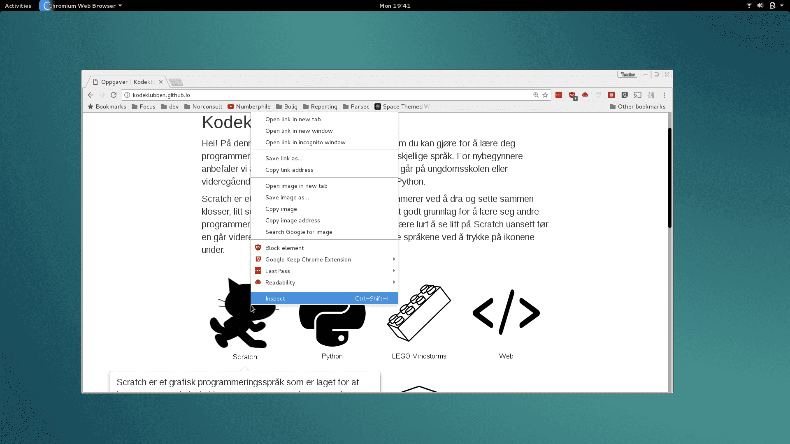
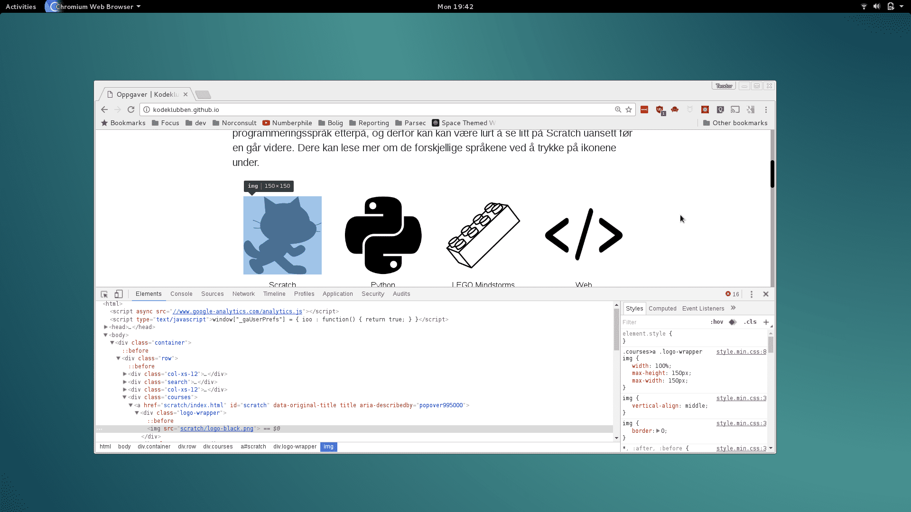
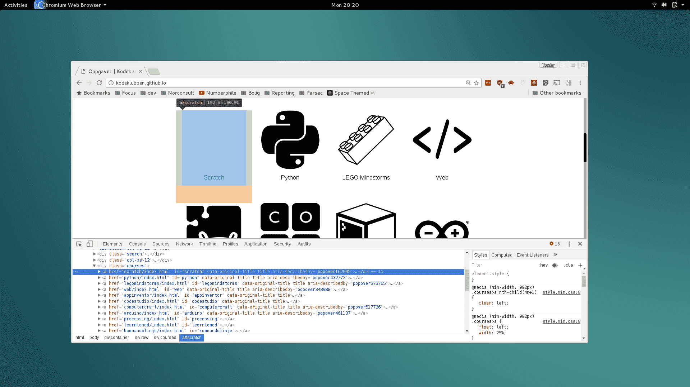
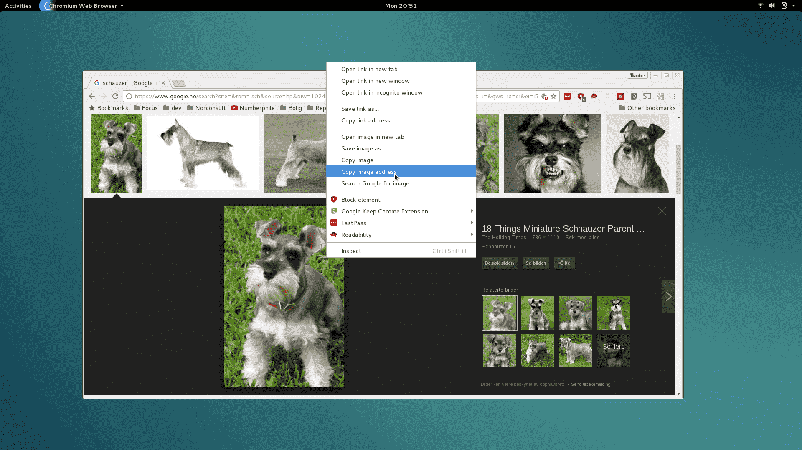

# Introduksjon {.intro}

Målet med oppgåva er å _vise_ kor HTML finst i verkelege nettsider, slik som den
sida du er på no. Når du er ferdig med oppgåva skal du ha litt betre kjennskap
til HTML, og du skal enkelt kunne endre på nettsider du er inne på.

Denne oppgåva er demonstrert i nettlesaren Google Chrome. Bruk denne nettlesaren
viss du har den.


# Steg 1: Sjå {.activity}

Men kor er all HTML-koden bak nettsidene me ser til vanleg? Den er gøymt bak
nettlesaren! La oss ta ein kikk.

## Aktivitetar {.check}

- [ ] Gå til [oppgaver.kidsakoder.no](http://oppgaver.kidsakoder.no) i Chrome
  eller Firefox

- [ ] Høgreklikk på katten og trykk `Inspiser` (norsk) eller `Inspect`
  (engelsk).

  

  Når me klikkar på `Inspiser`, får me sjå ein meny som er til hjelp for
  utviklarar. Denne er svært nyttig til webutvikling.

  

  Ser du den farga teksten, du òg? Det er HTML, slik Chrome les den! Kjeldekoden
  til nettsida.

  Kjeldekoden til katten ser slik ut:

  ```html
  
  ```

- [ ] Sjå om du finn att `scratch/logo_black.png` i kjeldekoden. Hald peikaren
  over filnamnet. Ser du fila dukkar opp?

- [ ] Inspiser slangen. Kva er filnamnet til slangen? Ser du det same som meg?

  

  Kjeldekoden til slangen ser slik ut:

  ```html
  
  ```

## Kva har me lært? {.protip}

**Høgreklikk og inspiser** finn HTML-koden til elementet me ser på.

**HTML-kode for bilete** ser slik ut:

```html

```


# Steg 2: Fjern {.activity}

Utviklarverktøyet i nettlesaren let oss tulle med HTML-koden til alle nettsider
me er på. Me øydelegg ikkje nettsidene, altså!

Alle endringar me gjer på nettsida blir altså att på datamaskina vår. Me
øydelegg ikkje for andre når me endrar på nettsider på denne måten!

## Alt borte vekk? {.protip}

Tips: viss du fjernar alt for mykje kan du berre oppdatere sida att. Då blir alt
som det var. Prøv!

## Aktivitetar {.check}

Me likar Minecraft. Men Minecraft er ikkje fyrst i lista over kurs! La oss gjere
noko med det og fjerne alt som er framfor det kurset!

- [ ] Høgreklikk på katten og inspiser. Finn elementet med katten. Fjern
  elementet med tasten `delete` på tastaturet!

  

- [ ] Yes! Katten vart borte!

  Men... Vent litt. Slangen gjekk ikkje til venstre. Kva skjedde no? Og det står
  jo framleis `Scratch` under den tomme plassen?

  

  Hmm... Det er ein usynleg boks der, den som tidlegare hadde katten i seg! Den
  heiter `<a>` og er ei lenke:

  ```html
  <a href="scratch/index.html" id="scratch" data-original-title="" title="" aria-describedby="popover162945">
    <div class="logo-wrapper">
    </div>
    <div class="name">
      <span>Scratch</span>
    </div>
  </a>
  ```

- [ ] Trykk på den vesle pila ved sidan av lenka `<a>`. Då gøymer me det som er
  inni lenka!

  

- [ ] Fjern teksten `Scratch`. Merk den som under, og trykk `delete`:

  

  Simsalabim!

  

  La oss fjerne litt meir.

- [ ] Fjern elementet som inneheldt alle kursa:

  ```html
  <div class="courses"> ... </div>
  ```

  

  Poff!

  

  Å nei! No vart alt borte!

  Last sida på nytt for å få den gamle tilbake.

  No må du hjelpe til med å få Minecraft fyrst i køa.

- [ ] Finn elementet som er den usynlege boksen rundt katten. Fjern det!

- [ ] Finn elementet som er den usynlege boksen rundt slangen. Fjern det!

- [ ] Gjer det same for `Lego Mindstorms`, `Web`, `App Inventor` og
  `CodeStudio`.

  

  Sånn skal det sjå ut!

## Kva har me lært? {.protip}

**HTML** inneheldt koder som er usynlege når me ser på ei nettside!

Desse kan vere lenker (`<a>`) eller boksar (`<div>`).

Me kan framleis finne og sjå alle dei usynlege kodene når me brukar `Inspiser`!


# Steg 3: Skap {.activity}

No skal me leike! La oss setje denne rakkaren


på **alle kursa**!


## Aktivitetar {.check}

- [ ] Finn et bilete du likar på Internett. Hent bileteadressa ved å høgreklikke
  på biletet:

  

- [ ] Endre alle bileta ved å redigere `src`-attributten til ``-taggen:

  


# Steg 4: Mykje moro! {.activity}

Gratulerer! Du har kome eit nytt steg på veg til å bli webutviklar!


