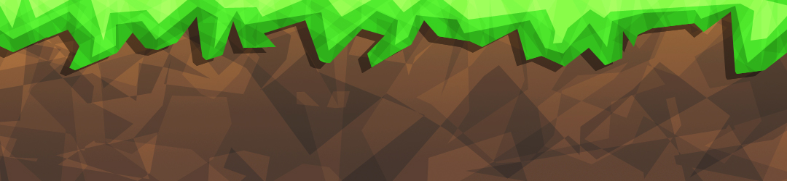

# Introduksjon {.intro}

Målet med oppgaven er å lære hvordan man lager en nettside med en meny og et
innholdsfelt.

I denne oppgaven forventer vi at du har vært gjennom HTML- og CSS-oppgavene så
langt og/eller er kjent med `<div>`- og HTML5-taggene.


# Steg 1: Vi starter fra toppen {.activity}

{.test} Før vi starter må vi ha en helt enkel HTML-side. Siden vi har lært å
bruke HTML5-tagger, så bruker vi det i denne oppgaven.

- [ ] Last ned og pakk ut [layout.zip](ressurser/layout.zip)

- [ ] Åpne `index.html` i din favoritt teksteditor

- [ ] Legg nå til bildet `header.jpg` innenfor taggen `<header>` (husk å legge
  til `alt`-tekst)

<toggle>
  <strong>Hint</strong>
  <hide>

  ```html
    <header>
        
    </header>
   ```
  </hide>
</toggle>

Bildet er 1080 (bredde) × 250 (høyde) piksler (`pixels` eller `px`) så vi velger
derfor å bruke bredden til bilde som et mål på hvor bred siden vår skal være.

Som du ser er det et hvitt mellomrom over og på siden av bildet. Dette kan vi
bli kvitt ved å bruke følgende CSS innenfor `<style>`:

```css
body{
    margin-top: 0;
    margin-bottom: 0;
    width: 1080px;
}
```

`margin-top: 0px; margin-bottom: 0px;` fjerner alle marger i `<body>` som
allerede ligger inne som standard. Denne midtstiller også `<body>`-taggen på
siden vår.

`width: 1080px;` forteller nettsiden vår at `<body>` skal være `1080px` bred.

Siden vi har definert hvor bred `<body>` skal være, så ser vi tydeligere at vi
har midtstilt headeren vår.

## __LAGRE__ filen og __VISE__ den i nettleseren din {.save}


# Steg 2: Legg til bakgrunn {.activity}

Nå som vi har et bilde som `header`, kan det være passende å finne en fin
bakgrunn. Ved hjelp av et utvidelsesverktøy til Chrome som heter
[ColorZilla](https://chrome.google.com/webstore/detail/colorzilla/bhlhnicpbhignbdhedgjhgdocnmhomnp){target=_blank},
så fant jeg ut hvilke grønnfarge som var på `header.jpg`. `ColorZilla` finnes
til `Firefox` [her](https://addons.mozilla.org/en-us/firefox/addon/colorzilla/){target=_blank}.
Fargen jeg har valgt å bruke er `#3DD14B`.

Siden vi nå har gjort `body` smalere (`1080px` bred) så kan vi nå bruke
`html`-selektoren i CSS for å sette bakgrunnsfarge. Da er det også viktig at vi
definerer hvor bred og høy `html`-en skal være, og det bør være hele nettlesern,
altså `100%`:

```css
html{
    height: 100%;
    width: 100%;
    background-color: #3DD14B;
}
```

## __LAGRE__ filen og __VISE__ den i nettleseren din {.save}


# Steg 3: Legg til meny {.activity}

Å legge til en meny er ikke bare bare. Vi skal nå gå gjennom steg for steg for å
få menyen til å se fin og ordentlig ut.

Det første vi må gjøre er å legge til lenker i menyen vår. Menyen vår skal ligge
i `<nav>`-taggen.

- [ ] Lag en liste og legg til 3 liste elementer som skal ha hver sin link.

<toggle>
  <strong>Hint</strong>
  <hide>

  ```html
    <nav>
        <ul>
            <il><a href="index.html">Hjem</a></il>
        </ul>
    </nav>
   ```
  </hide>
</toggle>

Nå ser siden vår slik ut:


Nå skal vi få vekk prikkene bak liste-elementene og gjøre sånn at de vises etter
hverandre mot venstre:

```css
nav ul li{
    float:left;             /* gjør at teksten flyter fra venstre mot høyre */
    list-style-type: none;  /* gjerner punktet foran liste-elementet */
}
```

- [ ] Kan du tenke deg hvorfor det står `nav ul li`?

Grunnen til at vi skriver `nav ul li` på denne er for å spesifisere at vi skal
sette stil på `li` (List items) i den uordnede listen `ul` som ligger innenfor
`nav`-taggen. På denne måten vil ikke andre lister bli påvirket av den stilen vi
setter, kun den lista som ligger mellom `<nav>`-taggen. Nå ser nettsiden vår
slik ut:


Nå ser vi at vi har fått liste-elementene våre til å legge seg mot høyre og har
ikke lengre punkter bak seg. Nå skal vi sette stil på hele lista og ikke bare
liste-elementene. For å gjøre dette må vi bruke `nav ul`. I koden under er det
nokså kjente ting. Vi midtstiller alt, setter en høyde og bredde på listen og vi
setter en kant rundt listen for å markere hvor menyen vår skal gå. Det siste,
`padding: 0px`, er for å fjerne et standard inntrykk som du får når du bruker
lister.

- [ ] Studer koden under

- [ ] Prøv å fjerne/kommentere ut en linje eller fler for å se hva de gjør.

- [ ] Forstår du hvorfor vi har `1072px` istedet for `1080px`?

```css
nav ul{
    margin-top: 0px;        /* fjerner marger og midtstiller */
    margin-bottom: 0px;
    width: 1072px;          /* setter bredden til 1040px, siden */
    height: 40px;           /* setter høyden til 40px */
    border: #000000 4px solid; /* Ramme rundt hele lista */
    padding: 0px;           /* Fjerner standard mellomrom mellom tekst og "vegger" */
}
```

Grunnen til at vi bruker `1072px` istedet for `1080px` er fordi vi har en
hovedramme som er på `4px`og som er på både høyre og venstre siden, altså `2 *
4px = 8px`.


Siden vi skal ha en meny, så har vi lagt inn lenker(`<a>`) i liste-elementene.
Vi må derfor legge til CSS for at disse skal vises på en skikkelig måte. Nå skal
vi dele inn hovedrammen vi har laget slik at det ser ut som lenkene er knapper.
I kodeblokken under ser du hvordan vi kan lage mellomrom mellom lenkene ved å
bruke `padding`, legge til en strek på høyre side for at den skal se ut som en
knapp, ta vekk understreker, gjøre skriften større og gjøre den grønn.

- [ ] Studer koden under

- [ ] Hva skjer om du fjerner `padding-left`og `padding-right`?

- [ ] Hva skjer om du fjerner `display: block`?

- [ ] Hva skjer om du fjerner `color: #3DD14B`?

- [ ] Prøv å endre på tallene og se hva som skjer.

```css
nav ul li a{
    display: block;         /* Gjør at kantene går helt opp til hovedrammen */
    padding-left: 20px;     /* mellomrommet til venstre fra teksten til rammen */
    padding-right: 20px;    /* mellomrommet til høyre fra teksten til rammen */
    line-height: 40px;      /* hvor høy linjen skal være */
    border-right: #000000 4px solid; /* legger til ramme med farge, tykkelse og stil */
    text-decoration: none;  /* tar vekk understreker */
    font-size: 20px;        /* setter skriftstørrelsen til 20px */
    color: #3DD14B;
}
```

### Nettsiden sålangt:


# Steg 4: Legge til innhold på siden {.activity}

Nå skal vi legge til en overskrift og litt tekst på siden vår. Dette gjør vi
innenfor `<section>`-taggen.

- [ ] Legg til en overskrift. Husker du hvilken tag man bruker da?

- [ ] Legg til litt tekst, du kan også legge til et bilde hvis du ønsker det

<toggle>
  <strong>Hint</strong>
  <hide>

  ```html
    <section>
        <h1>Overskrift</h1>
        <p>Noe tekst</p>
    </section>
   ```
  </hide>
</toggle>

- [ ] Legg til en passende bakgrunnsfarge på `section`

- [ ] Legg til en høyde på `section` slik at siden blir seendes større og mer
  komplett ut

- [ ] Legg til en passende farge på overskriften din

- [ ] Bruk `padding` til å få flytte overskriften litt vekk fra kanten på
  venstre side

- [ ] Gjør det samme du gjorde med overskriften, med paragrafen du har laget

- [ ] Dersom du la inn et bilde, prøv å få det sentrert på siden

<toggle>
  <strong>Hint</strong>
  <hide>

  ```css
    section{
        /* bakgrunnsfarge */
        /* høyde */
    }
    section h1{
        /* farge */
        /* padding */
    }
    section p{
        /* farge */
        /* padding */
    }
   ```
  </hide>
</toggle>

### Nettsiden sålangt:


# Steg 5: Legge til footer {.activity}

Nå skal vi legge til informasjon i `<footer>`. En `footer` er nederst på siden
og viser gjerne kontaktinformasjon til de som har siden, om det er copyright på
siden eller så er det også gjerne et `sitemap`. Et `sitemap` er en oversikt over
hele nettsiden sånn at det skal være enkelt for brukeren å finne frem på siden.
La oss nå bare legge litt en enkel tekst i `footeren`.

- [ ] Legg til en paragraf med navnet ditt og gjerne årstall eller datoen i dag.

Vi vil gjerne vise at `footeren` faktisk er en footer sånn at den ikke blandes
inn med `section`. Derfor kan det være lurt å legge til en `border` på toppen av
`footeren`. La oss nå legge til litt CSS.

- [ ] Legg til en passe høyde på `footer`

- [ ] Hvis du føler at vi trenger litt `padding`, så legg til det

- [ ] Legg til en passende bakgrunnsfarge

- [ ] Legg til en farge på teksten sånn at den syns bedre

- [ ] Legg til en `border-top` for å få en ramme øverst på `footeren`.

### Nå ser siden slik ut:


<toggle>
  <strong>Forslag til footer-CSS</strong>
  <hide>

  ```css
        footer{
            height: 40px;
            padding-left: 20px;
            padding-bottom: 10px;
            background-color: #634335;
            border-top: #3DD14B 4px solid;
            color:#3DD14B;
        }
   ```
  </hide>
</toggle>

__Gratulerer! Du har nå laget din første layout!__ La oss nå koble sammen flere
siden sånn at det ligner mer på en ordentlig side. Du har sikkert lagt merke til
at linkene våre i menyen ikke fungerer?


# Steg 6: Koble flere sider sammen {.activity}

Nå skal vi lage 2 nye sider med samme stil slik at alle sidene blir koblet
sammen. I `Steg 3: Legg til meny` lagde du meny og la til 2 lenker, nå skal vi
lage disse sidene. Jeg har brukt `side2.html` og `side3.html`. Du kan kalle dem
hva du vil.

- [ ] Kopier all kode fra `index.html` til 2 nye sider `side2.html` og
  `side3.html`.

- [ ] Nå skal du endre overskriften og teksten i `side2.html` og `side3.html`
  slik at du får 3 ulike sider

- [ ] Sørg for at de 2 sidene ligger i `nav` på alle sidene

__Eksempel:__

```html
<nav>
    <ul>
        <li><a href="index.html">Hjem</a></li>
        <li><a href="side2.html">Side 2</a></li>
        <li><a href="side3.html">Side 3</a></li>
    </ul>
</nav>
```

- [ ] Prøv å trykk deg til hver av sidene for å teste om lenkene fungerer.
  Fungerer de? Hvis ikke må du sjekke at alle filene ligger i samme mappe og er
  skrevet riktig.

__TADA! Du har nå laget en flott nettside som du kan bygge videre på!__

## Ting å jobbe videre med {.challenge}

- [ ] Bruk

      [w3schools.com/css/css_link.asp](http://www.w3schools.com/css/css_link.asp){target=_blank}

      til å legge til forandring på linkene når du holder over dem

- [ ] Legg til enda en side for eksempel "Mitt favorittspill". Skriv om det,
  legg til bilder og videoer som er relatert til spillet.

- [ ] Legg teksten på siden i en `div`-er og sett forskjellig stil på dem

- [ ] Del inn `section` slik at du kan få forskjellige deler på siden, hent
  gjerne inspirasjon fra internett. Feks: [vg.no](http://vg.no){target=_blank}


# Eksempel på kode for nettsiden {.activity}

__MERK:__ Legg merke til at under `border` er fargekoden `#000` i stedet for
`#000000`. Dette betyr akkurat det samme: `#rgb` eller `#rrggbb`. Ved 6 tall og
bokstaver kan du enklere spesifisere en mer nøyaktig farge enn hvis du bare
bruker `#rgb`. R = rød, G = grønn, B = blå. Det er tallene og bokstavene som
bestemmer hvor mye av rød, grønn og blå det skal være i fargen.

```html
<!DOCTYPE html>
<html>
<head>
<title>Layout</title>

<style>

    html{
        height: 100%;
        width: 100%;
        background-color:#3DD14B;

    }

    body{
        margin-top: 0px;
        margin-bottom: 0px;
        width: 1080px;
        background-color: #634335;
    }


    nav ul{
        margin-top: 0px;        /* fjerner marger og midtstiller */
        margin-bottom: 0px;
        width: 1072px;          /* setter bredden til 1040px, siden */
        height: 40px;           /* setter høyden til 40px */
        border: #000 4px solid; /* Ramme rundt hele lista */
        padding: 0px;           /* Fjerner standard mellomrom mellom tekst og "vegger" */
    }

    nav ul li{
        float:left;             /* gjør at teksten flyter mot venstre */
        list-style-type: none;  /* gjerner punktet foran liste-elementet */

    }

    nav ul li a{
        display: block;         /* Gjør at kantene går helt opp til hoved rammen */
        padding-left: 20px;     /* mellomrommet til venstre fra teksten til rammen */
        padding-right: 20px;    /* mellomrommet til høyre fra teksten til rammen */
        line-height: 40px;      /* hvor høy linjen skal være */
        border-right: #000 4px solid; /* legger til ramme med farge, tykkelse og stil */
        text-decoration: none;  /* tar vekk understreker */
        font-size: 20px;        /* setter skriftstørrelsen til 20px */
        color: #3DD14B;
    }

    section{
        background-color: #634335;
        height: 400px;
    }

    section h1{
        color: #FFF;
        padding-left: 30px;
    }

    section p{
        color: #3DD14B;
        padding-left: 30px;
    }

    footer{
        height: 40px;
        padding-left: 20px;
        padding-bottom: 10px;
        background-color: #634335;
        border-top: #3DD14B 4px solid;
        color:#3DD14B;
    }

</style>

</head>
<body>
    <header>
        
    </header>

    <nav>
        <ul>
            <li><a href="index.html">Hjem</a></li>
            <li><a href="side2.html">Side 2</a></li>
            <li><a href="side3.html">Side 3</a></li>
        </ul>

    </nav>

    <section>
        <h1>Velkommen</h1>
        <p>Dette er min nye kule hjemmeside.</p>

    </section>

    <footer>
        <p>Kodeklubben Trondheim, 2016</p>
    </footer>

</body>
</html>
```
