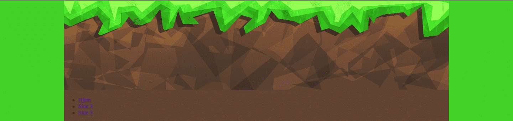

# Introduksjon {.intro}

Målet med oppgåva er å lære korleis ein lagar ei nettside med ein meny og eit
innhaldsfelt.

I denne oppgåva forventar me at du har vore gjennom HTML- og CSS-oppgåvene så
langt og/eller er kjent med `<div>`- og HTML5-taggane.


# Steg 1: Me startar frå toppen {.activity}

Før me startar må me ha ei heilt enkel HTML-side. Sidan me har lært å bruke
HTML5-taggar, så brukar me det i denne oppgåva.

- [ ] Last ned og pakk ut [layout.zip](ressurser/layout.zip).

- [ ] Åpne `index.html` i favoritt-teksteditoren din.

- [ ] Legg til biletet `header.jpg` innanfor taggen `<header>` (hugs å leggje
  til `alt`-tekst).

<toggle>
  <strong>Hint</strong>
  <hide>

  ```html
    <header>
        
    </header>
   ```
  </hide>
</toggle>

Biletet er 1080 (breidde) × 250 (høgde) pikslar (`pixels` eller `px`), så me vel
å bruke breitta til biletet som eit mål på kor brei sida vår skal vere.

Som du ser er det eit kvitt mellomrom over og på sida av biletet. Dette kan me
bli kvitt ved å bruke følgjande CSS innanfor `<style>`:

```css
body{
    margin-top: 0;
    margin-bottom: 0;
    width: 1080px;
}
```

`margin-top: 0px; margin-bottom: 0px;` fjernar alle margar i `<body>` som
allereie ligg inne som standard. Denne midtstiller òg `<body>`-taggen på sida
vår.

`width: 1080px;` fortel nettsida vår at `<body>` skal vere `1080px` brei.

Sidan me har definert kor brei `<body>` skal vere, så ser me tydelegare at me
har midtstilt headeren vår.

## Lagre prosjektet ditt {.save}

Hugs å __LAGRE__ fila og prøv å __VISE__ den i nettlesaren din.


# Steg 2: Legg til bakgrunn {.activity}

No som me har eit biletet som `header` kan det passe å finne ein fin bakgrunn.
Ved hjelp av eit utvidingsverktøy til Chrome som heiter
[ColorZilla](https://chrome.google.com/webstore/detail/colorzilla/bhlhnicpbhignbdhedgjhgdocnmhomnp){target=_blank},
kan du finne grønfarga som er på `header.jpg`. Utvidinga `ColorZilla` finst til
`Firefox` [her](https://addons.mozilla.org/en-us/firefox/addon/colorzilla/){target=_blank}.
Farga me har valt her er `#3DD14B`.

Sidan me har gjort `body` smalare (`1080px` brei) så kan me bruke
`html`-selektoren i CSS for å setje bakgrunnsfarga. Då er det viktig at me
hugsar å definere kor brei og høg `html`-en skal vere, og det bør vere heile
nettlesaren, altså `100%`:

```css
html{
    height: 100%;
    width: 100%;
    background-color: #3DD14B;
}
```

## Lagre prosjektet ditt {.save}

Hugs å __LAGRE__ fila og prøv å __VISE__ den i nettlesaren din.


# Steg 3: Legg til meny {.activity}

Å leggje til ein meny er ikkje berre berre. No skal me gå gjennom det steg for
steg slik at me får menyen til å sjå fin og ordentleg ut.

Det fyrste me må gjere er å leggje til lenker i menyen vår. Menyen vår skal
liggje i `<nav>`-taggen.

- [ ] Lag ei liste og legg til 3 liste-element som skal ha kvar si lenke.

<toggle>
  <strong>Hint</strong>
  <hide>

  ```html
    <nav>
        <ul>
            <il><a href="index.html">Heim</a></il>
        </ul>
    </nav>
   ```
  </hide>
</toggle>

No ser sida vår slik ut:



No skal me få bort prikkane bak liste-elementa og gjere så dei visast etter
kvarandre mot venstre:

```css
nav ul li{
    float:left;             /* gjer at teksten flyt frå venstre mot høgre */
    list-style-type: none;  /* fjernar punktet framfor liste-elementet */
}
```

- [ ] Kan du tenke deg kvifor det står `nav ul li`?

Grunnen til at me skriv `nav ul li` på denne er for å spesifisere at me skal
setje stil på `li` (list items) i den uordna lista `ul` som ligger innanfor
`nav`-taggen. På denne måten vil ikkje andre lister bli påverka av den stilen me
set, berre den lista som ligg inne i `<nav>`-taggen. No ser nettsida vår slik
ut:


No ser me at me har fått liste-elementa våre til å leggje seg mot høgre, og dei
har ikkje lengre punkt bak seg. No skal me setje stil på heile lista og ikkje
berre liste-elementa. For å gjere det må me bruke `nav ul`. I koden under er det
nokså kjente ting. Me midtstiller alt, set ei høgde og breidde på lista, og me
legg på ein kant rundt lista for å markere kor menyen vår skal gå. Det siste,
`padding: 0px`, er for å fjerne eit standard inntrykk som du får når du brukar
lister.

- [ ] Studér koden under.

- [ ] Prøv å fjerne/kommentere ut ei eller fleire linjer for å sjå kva dei gjer.

- [ ] Forstår du kvifor me har `1072px` i staden for `1080px`?

```css
nav ul{
    margin-top: 0px;        /* fjernar margar og midtstiller */
    margin-bottom: 0px;
    width: 1072px;          /* set breidda til 1040px, sida */
    height: 40px;           /* set høgda til 40px */
    border: #000000 4px solid; /* Ramme rundt heile lista */
    padding: 0px;           /* Fjernar standard mellomrom mellom tekst og "veggar" */
}
```

Grunnen til at me brukar `1072px` i staden for `1080px` er fordi me har ei
hovudramme som er på `4px` og som er på både høgre og venstre side, altså `2 *
4px = 8px`.


Sidan me skal ha ein meny så har me lagt inn lenker (`<a>`) i liste-elementa.
Difor må me leggje til CSS for at desse skal visast på ein skikkeleg måte. No
skal me dele inn hovudramma me har laga slik at det ser ut som lenkene er
knappar. I kodeblokka under ser du korleis me kan lage mellomrom mellom lenkene
ved å bruke `padding`, leggje til ein strek på høgre side for at den skal sjå ut
som ein knapp, ta bort understrekar, gjere skrifta større og gjere den grøn.

- [ ] Studér koden under.

- [ ] Kva skjer viss du fjernar `padding-left`og `padding-right`?

- [ ] Kva skjer viss du fjernar `display: block`?

- [ ] Kva skjer viss du fjernar `color: #3DD14B`?

- [ ] Prøv å endre på tala og sjå kva som skjer.

```css
nav ul li a{
    display: block;         /* Gjer at kantane går heilt opp til hovudramma */
    padding-left: 20px;     /* mellomrommet til venstre frå teksten til ramma */
    padding-right: 20px;    /* mellomrommet til høgre frå teksten til ramma */
    line-height: 40px;      /* kor høg linja skal vere */
    border-right: #000000 4px solid; /* legg til ramme med farge, tjukkleik og stil */
    text-decoration: none;  /* tar bort understrekar */
    font-size: 20px;        /* set skriftstorleiken til 20px */
    color: #3DD14B;
}
```

Dette er slik nettsida vår ser ut så langt:


# Steg 4: Leggje til innhald på sida {.activity}

No skal me leggje til ei overskrift og litt tekst på sida vår. Dette gjer me
innanfor `<section>`-taggen.

- [ ] Legg til ei overskrift. Hugsar du kva tag eit brukar då?

- [ ] Legg til litt tekst, du kan òg leggje til eit bilete viss du ynskjer det.

<toggle>
  <strong>Hint</strong>
  <hide>

  ```html
    <section>
        <h1>Overskrift</h1>
        <p>Noko tekst</p>
    </section>
   ```
  </hide>
</toggle>

- [ ] Legg til ei passande bakgrunnsfarge på `section`.

- [ ] Legg til ei høgde på `section` slik at sida ser større og meir komplett
  ut.

- [ ] Legg til ei passande farge på overskrifta di.

- [ ] Bruk `padding` til å flytte overskrifta litt bort frå kanten på venstre
  side.

- [ ] Gjer det same du gjorde med overskrifta med avsnittet du har laga.

- [ ] Viss du la inn eit bilete, prøv å få det sentrert på sida.

<toggle>
  <strong>Hint</strong>
  <hide>

  ```css
    section{
        /* bakgrunnsfarge */
        /* høgde */
    }
    section h1{
        /* farge */
        /* padding */
    }
    section p{
        /* farge */
        /* padding */
    }
   ```
  </hide>
</toggle>

Dette er slik nettsida vår ser ut så langt:


# Steg 5: Leggje til footer {.activity}

No skal me leggje til informasjon i `<footer>`. Ein `footer` er nedst på sida og
viser ofte kontaktinformasjon til dei som eig sida og om det er copyright på
sida. Det er gjerne eit `sitemap`. Eit `sitemap` er ei oversikt over heile
nettsida slik at det skal vere enkelt for brukaren å finne fram på sida. La oss
berre leggje litt enkel tekst i `footeren`.

- [ ] Legg til eit avsnitt med namnet ditt og gjerne årstalet eller datoen i
  dag.

Me vil vise at `footeren` faktisk er ein footer slik at den ikkje blir blanda
med `section`. Difor kan det vere lurt å leggje til ein `border` på toppen av
`footeren`. La oss leggje til litt CSS.

- [ ] Legg til ei passande høgde på `footer`.

- [ ] Viss du føler at me treng litt `padding` legg du til det.

- [ ] Legg til ei passande bakgrunnsfarge.

- [ ] Legg til ei farge på teksten slik at den synest betre.

- [ ] Legg til ein `border-top` for å få ei ramme øvst på `footeren`.

Dette er slik nettsida vår ser ut så langt:


<toggle>
  <strong>Forslag til footer-CSS</strong>
  <hide>

  ```css
        footer{
            height: 40px;
            padding-left: 20px;
            padding-bottom: 10px;
            background-color: #634335;
            border-top: #3DD14B 4px solid;
            color:#3DD14B;
        }
   ```
  </hide>
</toggle>

__Gratulerer! No har du laga din fyrste layout!__ La oss kople saman fleire
sider slik at det liknar meir på ei ordentleg nettside. Du har sikkert lagt
merke til at lenkene i menyen vår ikkje fungerer?


# Steg 6: Kople saman fleire sider {.activity}

No skal me lage to nye sider med same stil, slik at alle sidene blir kopla
saman. I [steg 3](#Steg-3:-Legg-til-meny) laga du ein meny og la til to lenker.
No skal me lage sidene dei lenkar til. Her har me brukt `side2.html` og
`side3.html`. Du kan kalle dei kva du vil.

- [ ] Kopier all kode frå `index.html` til to nye sider `side2.html` og
  `side3.html`.

- [ ] No skal du endre overskrifta og teksten i `side2.html` og `side3.html`
  slik at du får tre ulike sider.

- [ ] Syt for at dei to sidene ligg i `nav` på alle sidene.

__Døme:__

```html
<nav>
    <ul>
        <li><a href="index.html">Heim</a></li>
        <li><a href="side2.html">Side 2</a></li>
        <li><a href="side3.html">Side 3</a></li>
    </ul>
</nav>
```

- [ ] Prøv å trykkje deg til kvar av sidene for å teste om lenkene fungerer.
  Fungerer dei? Viss ikkje må du sjekke at alle filene ligg i same mappe og er
  skrive riktig.

__TADA! Du har laga ei flott nettside du kan byggje vidare på!__

## Ting å jobbe vidare med {.challenge}

- [ ] Bruk

  [w3schools.com/css/css_link.asp](http://www.w3schools.com/css/css_link.asp){target=_blank}

  til å leggje til forandring på lenkene når du heldt over dei.

- [ ] Legg til endå ei side, til dømes "Mitt favorittspel". Skriv om det, legg
  til bilete og videoar som er relatert til spelet.

- [ ] Legg teksten på sida i `div`-ar og set ulik stil på dei.

- [ ] Del inn `section` slik at du kan få ulike delar på sida, hent gjerne
  inspirasjon frå Internett. Til dømes [vg.no](http://vg.no){target=_blank}


# Døme på kode for nettsida {.activity}

__MERK:__ Legg merke til at under `border` er fargekoden `#000` i staden for
`#000000`. Dette tyder akkurat det same: `#rgb` eller `#rrggbb`. Viss du brukar
6 tal og bokstavar kan du enklare spesifisere nøyaktig farge enn berre med
`#rgb`. R = raud, G = grøn, B = blå. Det er tala og bokstavane som bestemmer kor
mykje raud, grøn og blå det skal vere i farga.

```html
<!DOCTYPE html>
<html>
<head>
<title>Layout</title>

<style>

    html{
        height: 100%;
        width: 100%;
        background-color:#3DD14B;

    }

    body{
        margin-top: 0px;
        margin-bottom: 0px;
        width: 1080px;
        background-color: #634335;
    }

    nav ul{
        margin-top: 0px;        /* fjernar marger og midtstiller */
        margin-bottom: 0px;
        width: 1072px;          /* set breidda til 1040px, sidan */
        height: 40px;           /* set høgda til 40px */
        border: #000 4px solid; /* Ramme rundt heile lista */
        padding: 0px;           /* Fjernar standard mellomrom mellom tekst og "veggar" */
    }

    nav ul li{
        float:left;             /* gjer at teksten flyt mot venstre */
        list-style-type: none;  /* fjernar punktet framfor liste-elementet */

    }

    nav ul li a{
        display: block;         /* Gjer at kantane går heilt opp til hovudramma */
        padding-left: 20px;     /* mellomrommet til venstre frå teksten til ramma */
        padding-right: 20px;    /* mellomrommet til høgre frå teksten til ramma */
        line-height: 40px;      /* kor høg linja skal vere */
        border-right: #000 4px solid; /* legg til ramme med farge, tjukkleik og stil */
        text-decoration: none;  /* tek bort understrekar */
        font-size: 20px;        /* set skriftstorleiken til 20px */
        color: #3DD14B;
    }

    section{
        background-color: #634335;
        height: 400px;
    }

    section h1{
        color: #FFF;
        padding-left: 30px;
    }

    section p{
        color: #3DD14B;
        padding-left: 30px;
    }

    footer{
        height: 40px;
        padding-left: 20px;
        padding-bottom: 10px;
        background-color: #634335;
        border-top: #3DD14B 4px solid;
        color:#3DD14B;
    }

</style>

</head>
<body>
    <header>
        
    </header>

    <nav>
        <ul>
            <li><a href="index.html">Heim</a></li>
            <li><a href="side2.html">Side 2</a></li>
            <li><a href="side3.html">Side 3</a></li>
        </ul>

    </nav>

    <section>
        <h1>Velkommen</h1>
        <p>Dette er den nye kule heimesida mi.</p>

    </section>

    <footer>
        <p>Kodeklubben Trondheim, 2016</p>
    </footer>

</body>
</html>
```
