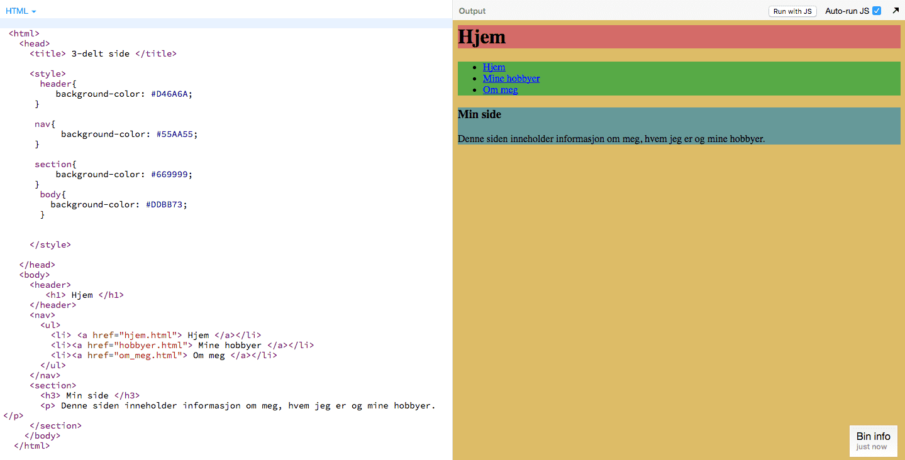

# Introduksjon {.intro}

I denne oppgaven må du bruke det du har lært til nå for å lage 3 nettsider som
skal linke til hverandre. Her er et eksempel: [www.ulv.no](http://sobakk.no/iver/Smaoppgaver/dyr/ulv.html){target=_blank}.

Denne siden linker til 2 nye sider som linker tilbake igjen til ulv.no. I denne
oppgaven skal vi gjøre det samme bare at alle sidene skal lenke til hverandre.


# Lenk sammen nettsider {.activity}

- [ ] Lag 3 nye HTML-sider eller bruk 3 sider fra de tidligere oppgaven

- [ ] Lenk den først siden til de 2 andre sidene (Husk: sidene bør ligge i
  sammen mappe

- [ ] Lagre og prøv å komme deg fra den første siden til de 2 andre sidene.

__Fungerer det ikke?__

Prøv hintene under og sørg for at sidene ligger i samme mappe.

<toggle>
 <strong>Hint 1</strong>
 <hide>

   ```html
        <a href="side2.html"> Side 2 </a>
        <a href="side3.html"> Side 3 </a>
   ```
 </hide>
</toggle>

<br/>

Dersom du bruker [`<nav>`-taggen](http://www.w3schools.com/tags/tag_nav.asp){target=_blank} fra
oppgave [“Del inn nettsiden"](../del_inn_nettsiden/del_inn_nettsiden.html){target=_blank}, så
kan du legge lenkene inne i `<nav>`-taggen.

<toggle>
 <strong>Hint 2</strong>
 <hide>

 ```html
  <nav>
      <ul>
        <li> <a href="side2.html">Side 2 </a> </li>
        <li> <a href="side3.html"> Side 3 </a> </li>
      </ul>
  </nav>
   ```
 </hide>
</toggle>

- [ ] Nå skal du lenke sammen de 2 andre sidene med hverandre og med den første
  siden sånn at alle sidene linker til hverandre.

__Bra jobba!__ Nå har du 3 sider som er lenket til hverandre.


# Et eksempel {.activity}

Her er et eksempel på 3 sider som er knyttet sammen. Koden er hentet fra oppgaven [“Del
inn nettsiden"](../del_inn_nettsiden/del_inn_nettsiden.html){target=_blank} hvor vi lære
hvordan vi delte inn nettsiden ved hjelp av `<div>`- og `<nav>`-tagger.

## Hjem



## Mine hobbyer


## Om meg


# TIPS {.challenge}

Bruk gjerne [w3schools](http://www.w3schools.com/){target=_blank} for å få enda mer hjelp eller
lese mer om HTML-tagger. Dersom det er vanskelig språk så spør du en voksen,
lærere eller veileder.
