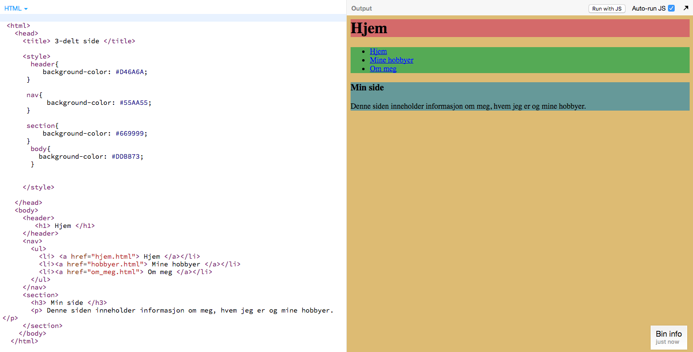
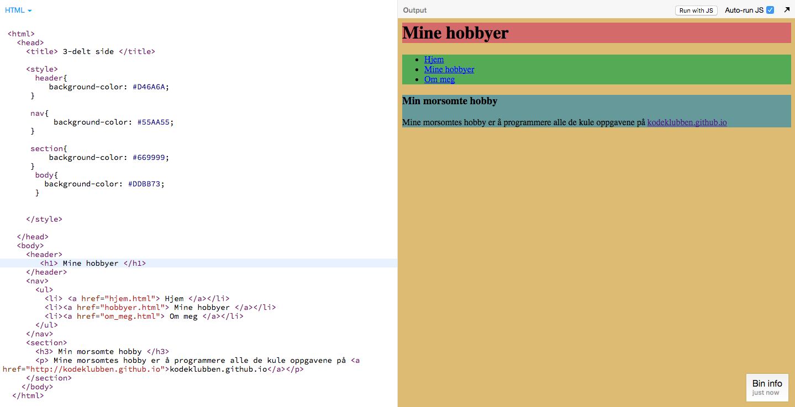
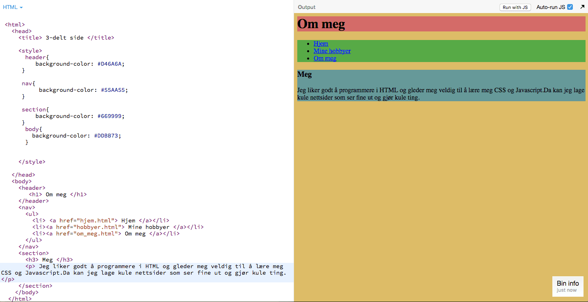

# Introduksjon {.intro}

I denne oppgåva må du bruke det du har lært til no for å lage tre nettsider som
skal lenke til kvarandre. Her er eit døme: [www.ulv.no](http://sobakk.no/iver/Smaoppgaver/dyr/ulv.html){target=_blank}.

Denne sida lenkar til to ny sider som lenkar tilbake att til ulv.no. I denne
oppgåva skal me gjere det same, men alle sidene skal lenke til kvarandre.


# Lenk saman nettsider {.activity}

- [ ] Lag tre nye HTML-sider, eller bruk tre sider frå dei tidlegare oppgåvene.

- [ ] Lenk den fyrste sida til dei to andre sidene (hugs at sidene bør liggje i
  same mappe).

- [ ] Lagre og prøv. Kjem du deg frå den fyrste sida til dei to andre sidene?

__Fungerer det ikkje?__

Prøv hinta under, og pass på at sidene ligg i same mappe.

<toggle>
 <strong>Hint 1</strong>
 <hide>

   ```html
        <a href="side2.html"> Side 2 </a>
        <a href="side3.html"> Side 3 </a>
   ```
 </hide>
</toggle>

Viss du brukar [`<nav>`-taggen](http://www.w3schools.com/tags/tag_nav.asp){target=_blank} frå
oppgåva [Del inn nettsida](../del_inn_nettsiden/del_inn_nettsiden_nn.html){target=_blank}, så
kan du leggje lenkene inne i `<nav>`-taggen.

<toggle>
 <strong>Hint 2</strong>
 <hide>

 ```html
  <nav>
      <ul>
        <li> <a href="side2.html">Side 2 </a> </li>
        <li> <a href="side3.html"> Side 3 </a> </li>
      </ul>
  </nav>
   ```
 </hide>
</toggle>

- [ ] No skal du lenke saman dei to andre sidene med kvarandre, og med den
  fyrste sida slik at alle sidene lenkar til kvarandre.

__Bra jobba!__ No har du tre sider som lenkar til kvarandre.


# Eit døme {.activity}

Her er eit døme på tre sider som er knytt saman. Koden er henta frå oppgåva [Del inn
nettsida](../del_inn_nettsiden/del_inn_nettsiden_nn.html){target=_blank}, der me lærte korleis
me deler inn nettsida ved hjelp av `<div>`- og `<nav>`-taggar.

## Heim



## Hobbyane mine



## Om meg




# TIPS {.challenge}

Du må gjerne bruke [w3schools](http://www.w3schools.com/){target=_blank} for å få endå meir
hjelp eller lese meir om HTML-taggar. Viss det er vanskeleg språk så spør du ein
vaksen, lærarar eller rettleiaren din.
