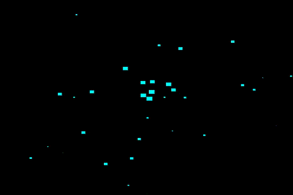

# Introduction {.intro}
I denne oppgaven skal vi bruke JavaScript til å få figurer vi å bevege seg. Vi skal altså lære å animere ved hjelp av JavaScript og noe som heter `Canvas`. 



I denne oppgaven vil du få bruk for det du har lært i oppgaven [Grunnleggende JavaScript](../grunnleggene_js/grunnleggende_js.html). 

# Steg 1: Canvas-elementet {.activity}
I HTML bruker vi `<canvas>` til å tegne figurer ved hjelp av JavaScript. Selve `<canvas>`-elementet gjør ikke så stor nytte for seg, så derfor bruker vi JavaScript til å fortelle hva slags grafikk `<canvas>`-elementet skal inneholde. La oss prøve det ut:

+ Åpne favoritt teksteditoren din
+ Lag en ny HTML-fil som heter `partikler.html`
+ Kopier koden under inn i `partikler.html`:

```html
<html>
<head>
    <meta charset="UTF-8">
    <title>Partikkel-fest</title>
    <style>
        body {
            background-color:#666;
        }

        #canvas {
            background-color:#000;
            margin-left:100px;
        }
    </style>

</head>
<body>
    <canvas id="canvas" width="500" height="500"></canvas>
</body>
</html>

```

## Forklaring {.tip}
+ `<canvass id="canvas" width="500" height="500"></canvas>` er selve `Canvas`-elementet. Den har en gitt høyde og bredde `500px x 500px`. Vi skal bruke JavaScript til å lage andre elementer inne i `canvas`-elementet. 
+ I CSSen er det lagt til en `grå` bakgrunnsfarge til `<body>` og sort bakgrunnsfarge til `<canvas>`. 
##

# Steg 2: Tegn et objekt {.activity}
Nå som vi vet hvordan `canvas` ser ut er det på tide å prøve det ut:

+ Sett inn `<script> </script>` i koden din

+ Lag to tomme variabeler: 
```js
var canvas;
var ctx;
```

Vi skal nå fylle disse variablene når siden vår lastes, da bruker vi noe som heter `window.onload`:

```js
window.onload = function() {
    canvas = document.getElementById("canvas");
    ctx = canvas.getContext("2d");
}
```
`Canvas`-variabelen holder nå på HTML-elementet vårt.

`ctx`-variabelen vil være det grafiske elementet som blir lagt til i `canvas`, dette elementet kan vi manipulere ved hjelp av stil, som vi skal se på snart. 

For å kunne lage grafikk i `canvas` er de to linjene over påkrevd, så nå som vi har det på plass kan vi starte å tegne! 

## Forklaring: Objekt {.tip}
La oss nå lage et `objekt` som skal tegnes. I JavaScript er et objekt en variabel som kan holde på flere verdier eller variabler. La oss se på et raskt eksempel med en bil:

```js
var bil = {
    navn: "Volkswagen",
    modell: "Golf"
    antallSeter: 5,
    farge: "Blå",
};
```

Så nå kan vi enkelt hente ut informasjonen vi vil ha fra objektet ved å skive følgende:

```js
console.log(bil.navn); // Skriver ut navnet på bilen: Volkswagen
console.log(bil.farge); // Skriver ut fargen på bilen: Blå
```

På denne måten slipper vi å lage mange variabler, som skal høre til samme element, vi bruker bare `objekter`. 

##

+ Lag et objekt som heter `particle` og som inneholder følgende attributter: `x`-posisjon, `y`-posisjon, `størrelse`

+ Bestem selv en passende verdi for attributtene. Disse kan være lurt å eksperimentere litt med senere i oppgaven. 

<toggle>
    <strong> Hint </strong>
    <hide>
        Setter du x og y til 0, så vil den starte oppe i venstre hjørne. Høyden og bredden er piksel-verdier (px).
    </hide>
</toggle>

+ Lag en funksjon som heter `draw`. Denne skal tegne elementet for oss.

+ I `draw` skal vi nå legge til hvilke farge vi vil at elementet vårt skal ha, du bestemmer selv hvilken farge:
```js
ctx.fillStyle = "red";
```
+ Nå skal vi tegne et kvadrat (firkant hvor alle sidene er like lange) i fargen vi valgte over:
```js
ctx.fillRect(particle.x,particle.y,particle.size,particle.size);
```

## Forklaring: ctx.fillRect() {.tip}
`ctx.fillRect()` tar inn 4 variabler:
```js
ctx.fillRect(x-posisjon, y-posisjon, bredde, høyde); 
```
Over brukte vi de attributtene vi lagde i objektet `particle`.

I vårt objekt `particle` har vi satt en `x`- og `y`-posisjon, samt en størrelse som vi setter på både `bredde` og `høyde` for å få et kvadrat. 
##

+ Lagre og kjør funksjonen `draw()` når siden lastes.


Forslag til koden så langt:

```html
CTYPE html>
<html lang="en">
<head>
    <meta charset="UTF-8">
    <title></title>
    <style>
        body {
            background-color: #666;
        }

        #canvas {
            background-color: #000;
            margin-left: 100px;
        }
    </style>
    <script>

        var canvas, ctx;

        var particle = {
            x: 0,
            y: 0,
            size: 10
        };

        window.onload = function() {
            canvas = document.getElementById("canvas");
            ctx = canvas.getContext("2d");
            draw(); 
        };


        //Tegner particle
        function draw() {
            ctx.fillStyle = 'red';
            ctx.fillRect(particle.x, particle.y,particle.size,particle.size);
        };
      
    </script>

</head>
<body>

<canvas id="canvas" width="500" height="500"></canvas>

</body>
</html>

```

# Steg 3: Flytt på partikkelet {.activity}
