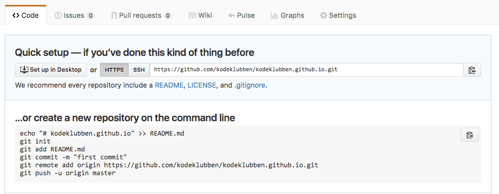
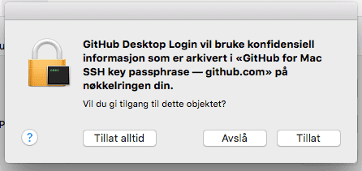

# Publiser nettsiden din på Internett{ .activity }

Nå har du laget ditt eget nettsted. Du ønsker vel å vise det frem, gjør du ikke?

Husker du servere fra den første økten? Servere er datamaskiner som alltid er på
og koblet til Internett, og de er satt opp slik at folk kan besøke nettsteder
som lever på disse datamaskinene.

For å legge nettsiden vår på internett skal vi nå bruke [Github
Pages](https://pages.github.com){target=_blank}. Det er det __Kodeklubben__ bruker:
`kodeklubben.github.io`. For at du skal kunne gjøre dette må du ha en
epost-adresse. Du kan enten lage din egen ([Gmail](http://gmail.com){target=_blank}), bruk den
du har på skolen eller spørre om å låne foreldrene dine sin. Det er viktig her
at du husker hvilken epost du har brukt, du må også ha tilgang til eposten slik
at du får godkjent brukeren på `Github`.


# Github {.activity}

Github er en samarbeidsplattform for oss som driver med programmering. Her kan
vi legge ut prosjekter som andre kan hjelpe til med, eller vi kan finne et
prosjekt vi kan bidra på. På denne måten kan vi enkelt hjelpe, samarbeide og
dele med alle som driver med programmering i verden. Vi skal nå lage en
`GitHub`-bruker.

- [ ] Gå inn på [Github.com](http://github.com){target=_blank}

- [ ] Skriv inn `Username`(brukernavn), `epost` og `password`(passord) før du
  trykker `Sign up for Github` (se bilde under)

  

- [ ] Følg instruksjonene videre for å godkjenne og lage ferdig brukeren din


# Brukernavn.github.io {.activity}

Nå som vi har en `Github-bruker` kan vi registrere en `github.io`-side.

- [ ] Logg inn på [Github.com](http://github.com){target=_blank} med den nye brukeren din, hvis
  du ikke allerede er logget inn

- [ ] Trykk på `New repository` (Grønn knapp til høyre eller `+` øverst i høyre
  hjørne rett ved siden av probilbildet ditt, se bilde under)

  

- [ ] Under `Repository name` så skriver du `ditt-brukernavn.github.io`. Under
  ser du et eksempel med `kodeklubben.github.io`.

  

- [ ] Du kan gjerne skrive en beskrivelse av nettsiden under `Description`

- [ ] Velg enten `Public`(alle kan se koden din) eller `Private`(koden til
  nettsiden blir privat). Vi har valgt `Public`

- [ ] Trykk `Create repository`(Lag oppbevaringssted).

  Nå skal vi laste ned `repository`-et eller `repo`-et vårt, altså
  oppbevaringsstedet for koden til nettsiden vår. Denne koden legges i en mappe
  lokalt på datamaskinen vår. I denne mappen legger vi inn alle filene som skal
  brukes til nettsiden og bruker programmet eller kommandolinjen til `Github`
  for å laste opp kode til `ditt-brukernavn.github.io`-siden vår.

- [ ] Trykke på `Set up in Desktop`:

  

  Hvis du er vant til å bruke `kommandolinjen` til `Linux` eller `Mac OS X`, så
  kan du gjøre det som står under `...or create a new repository on the command
  line`.

- [ ] Du vil få spørsmål om å laste ned Github-programmet, takk ja til det.

- [ ] Trykk `Tillat` på eventuelle ting som dukker opp når `Github`-programmet
  åpner seg:

  

- [ ] Hvis du får spørsmål om å logge inn så logger du bare inn med
  `Github`-brukeren du lagde i sted

- [ ] Du får nå spørsmål om å legge mappen `ditt-brukernavn.github.io` et sted
  lokalt på datamaskinen, legg det et passende sted hvor du finner det igjen.
  For eksempel på `Skrivebordet` eller i `Mine dokumenter`.

  For å ikke ødelegge det vi har på `kodeklubben.github.io` skal jeg videre vise
  med brukeren `larsfk.github.io`.

  

  Da er det på tide å laste opp hjemmesidens første fil!

- [ ] Åpne mappen `ditt-brukernavn.github.io`. Min heter `larsfk.github.io` og
  ligger på `Skrivebordet`.

  

- [ ] Åpne din favoritt `teksteditor` (Atom, NodePad, Brackets IO, NodePad++)

- [ ] Lag `index.html` og lagre den i mappen `ditt-brukernavn.github.io`. Dette
  skal være startsiden til nettsiden vår.

  

- [ ] Skriv noe `HTML` i `index.html`. Du kan gjerne kopiere en av oppgavene du
  allerede har laget. Hvis du ikke vet hva du skal skrive kan du for eksempel
  skrive noe sånt:

  ```html
  <!DOCTYPE html>
  <html>
      <body>
          <h1>Min første hjemmeside!</h1>
          <p>Denne hjemmesiden er laget med Git Pages.</p>
      </body>
  </html>
  ```

Nå skal vi laste opp denne filen til `ditt-brukernavn.github.io`.


# Oppdater ditt-brukernavn.github.io {.activity}

- [ ] Åpne `Github`-programmet

- [ ] Trykk på `ditt-brukernavn.github.io` i kolonnen til venstre

- [ ] Trykk på `Compare`.

  

  Når du trykker på `Compare` begynner `Github` å sammenligne det som ligger i
  mappen `ditt-brukernavn.github.io` med det som ligger på nettsiden
  `ditt-brukernavn.github.io`. Alt som er `grønt` er det som er lagt til og alt
  som blir `rødt` er det endringer som er fjernet. Under har jeg kun lagt til ny
  kode, derfor er koden `grønn`.

- [ ] Må du `committe` endringene du har gjort før du får lagt opp filen til
  `Github`-en din. For å gjøre dette skriver du en kort forklaring i `Summary`,
  og litt mer detaljert beskrivelse av hva som er gjort i `Description`, som
  vist på bildet over

- [ ] Trykk på `Commit to master` når du har skrevet om endringene som er gjor

- [ ] Nå kan du trykke på `Publish` øverst til høyre

  

- [ ] Hvis du får spørsmål om å `Tillate` en operasjon, så gjør det

- [ ] Nå ser vi (se bildet over) at en `commit` er lagt til og `pushet`(lastet
  opp) til siden vår. Gå inn på `ditt-brukernavn.github.io` (`larsfk.github.io`
  for meg) for å se hjemmesiden din!

NB! Stegene over må du gjøre hver gang du skal oppdatere nettsiden din!


__Gratulerer med ny hjemmeside!__ Denne kan du dele med hvem du vil ved å sende
lenken `ditt-brukernavn.github.io`.


# Vil du lære mer om GitHub? {.challenge}

GitHub er et stort tema og kan være litt komplisert og vrient i starten, men jeg
hvis du vil lære mer sjekk ut tipsene under:

Les mer om GitHub her: [https://www.atlassian.com/git/tutorials](https://www.atlassian.com/git/tutorials){target=_blank} eller på [Kodeklubbens wiki](https://github.com/kodeklubben/oppgaver/wiki/Komme-i-gang-med-Git){target=_blank}

Søk på `GitHub Tutorials` på [YouTube](http://youtube.com){target=_blank} F.eks: [GitHub for noobs](https://www.youtube.com/watch?v=BKr8lbx3uFY){target=_blank}
