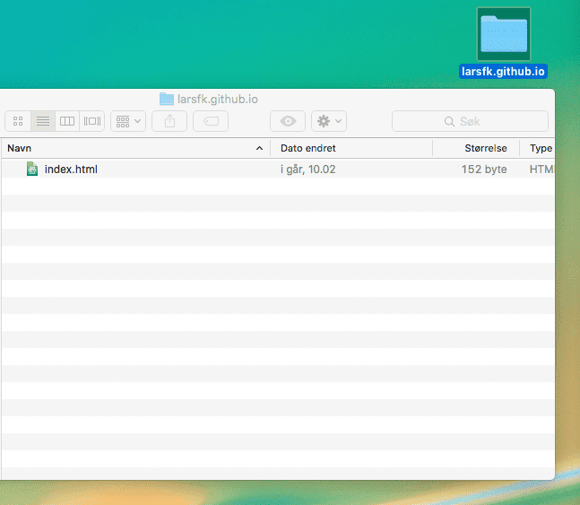
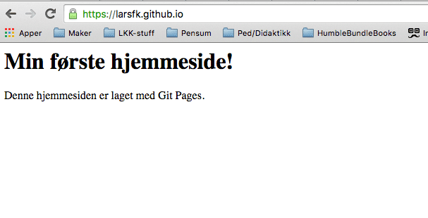

# Publiser nettsida di på Internett {.intro}

No har du laga din eigen nettstad. Du vil vel vise det fram, gjer du ikkje?

Hugsar du *serverane* frå den fyrste øykta? Serverar er datamaskiner som alltid
er på og kopla til Internett, og dei er sett opp slik at folk kan besøke
nettstader som lev på desse datamaskinene.

For å leggje nettsida vår på Internett skal me bruke [Github
Pages](https://pages.github.com){target=_blank}. Det er det __Kodeklubben__ brukar:
`kodeklubben.github.io`. For at du skal kunne gjere det må du fyrst ha ei
epost-adresse. Du kan lage din eigen ([Gmail](http://gmail.com){target=_blank}), bruke den du
har på skulen, eller spørje om å låne foreldra dine sin. Det er viktig at du
hugsar kva epost du har brukt, og at du har tilgang på innboksen slik at du får
godkjent brukaren på `GitHub`.


# Github {.activity}

GitHub er ein samarbeidsplattform for oss som driv med programmering. Her kan me
leggje ut prosjekt som andre kan hjelpe til med, eller me kan finne eit prosjekt
me kan bidra på. Slik kan me enkelt hjelpe, samarbeide og dele med alle andre
som driv med programmering i verda. No skal me lage ein `GitHub`-brukar.

- [ ] Gå inn på [Github.com](http://github.com){target=_blank}.

- [ ] Skriv inn `Username` (brukarnamn), `epost` og `password` (passord) før du
  trykkar `Sign up for Github` (sjå biletet under).

  §[Bilete av GitHub-nettsida](ressurser/sign-in-1.png)

- [ ] Følg instruksjonane vidare for å godkjenne og lage ferdig brukaren din.


# Brukarnamn.github.io {.activity}

No som me har ein `Github-brukar` kan me registrere ei `github.io`-side.

- [ ] Logg inn på [Github.com](http://github.com){target=_blank} med den nye brukaren din viss
  du ikkje allereie er logga inn.

- [ ] Trykk på `New repository` (ein grøn knapp oppe til venstre, eller under
  `+` øvst i høgre hjørne).

  

- [ ] Under `Repository name` skriv du `ditt-brukarnamn.github.io`. Under ser du
  korleis me gjorde det for `kodeklubben.github.io`.

  

- [ ] Du kan gjerne skrive ei beskriving av nettsida under `Description`.

- [ ] Som standard er repository-et `Public` (alle kan sjå koden din). For å
  velje `Private` (koden til nettsida blir privat) må du betale for det. Me har
  valt `Public`.

- [ ] Trykk `Create repository` (lag oppbevaringsstad).

  No skal me laste ned `repository`-et eller `repo`-et vårt, altså
  oppbevaringsstaden for koden til nettsida vår. Denne koden legg me i ei mappe
  lokalt på datamaskina vår. I denne mappa legg me inn alle filene som skal
  brukast til nettsida, og me brukar programmet eller kommandolinja til GitHub
  for å laste opp kode til `ditt-brukarnamn.github.io`-sida vår.

- [ ] Trykk på `Set up in Desktop`:

  

  Viss du er vant til å bruke `kommandolinja` til `Linux` eller `Mac OS X`, så
  kan du gjere det som står under `...or create a new repository on the command
  line`.

- [ ] Du kjem til å få spørsmål om å laste ned Github-programmet. Takk ja til
  det.

- [ ] Trykk `Tillat` på eventuelle ting som dukkar opp når `Github`-programmet
  åpnar seg:

  

- [ ] Viss du får spørsmål om å logge inn, så loggar du berre inn med
  `Github`-brukaren du laga i stad.

- [ ] No får du spørsmål om å leggje mappa `ditt-brukarnamn.github.io` ein stad
  lokalt på datamaskina. Legg det ein stad der du finn det att. Til dømes på
  `Skrivebordet` eller i `Mine dokument`.

  For ikkje å øydeleggje noko på `kodeklubben.github.io` blir dei neste stega
  vist med brukaren `larsfk.github.io`.

  

  No er det endeleg på tide å laste opp den fyrste fila til heimesida!

- [ ] Åpne mapp `ditt-brukarnamn.github.io`. Her heiter mappa `larsfk.github.io`
  og ligg på `Skrivebordet`.

  

- [ ] Åpne favoritt-teksteditoren din (Atom, NodePad, Brackets IO, NodePad++).

- [ ] Lag `index.html` og lagre den i mappa `ditt-brukarnamn.github.io`. Dette
  skal vere startsida til nettsida vår.

  

- [ ] Skriv noko `HTML` i `index.html`. Du kan gjerne kopiere ei av sidene du
  allereie har laga før. Viss du ikkje veit kva du skal skrive kan du til dømes
  skrive noko som:

  ```html
  <!DOCTYPE html>
  <html>
      <body>
          <h1>Mi fyrste heimeside!</h1>
          <p>Denne heimesida er laga med GitHub Pages.</p>
      </body>
  </html>
  ```

No skal me laste opp denne fila til `ditt-brukarnamn.github.io`.


# Oppdater ditt-brukarnamn.github.io {.activity}

- [ ] Åpne `Github`-programmet.

- [ ] Trykk på `ditt-brukarnamn.github.io` i kolonna til venstre.

- [ ] Trykk på `Compare`.

  

  Når du trykkar på `Compare` vil `Github` starte å samanlikne det som ligg i
  mappa `ditt-brukarnamn.github.io` med det som ligg på nettsida
  `ditt-brukarnamn.github.io`. Alt som er `grønt` er det som er lagt til og alt
  som blir `raudt` er ting som er fjerna. I biletet over er det berre ny kode,
  difor er koden `grøn`.

- [ ] Du må `committe` endringane du har gjort før du får lagt opp fila til
  `Github`-en din. For å gjere det skriv du ei kort forklaring i `Summary`, og
  kanskje ei litt meir detaljert beskriving av kva som er gjort i `Description`,
  slik som på biletet over.

- [ ] Trykk på `Commit to master` når du har skrive om endringane du har gjort.

- [ ] No kan du trykkje på `Publish` øvst til høgre.

  

- [ ] Viss du får spørsmål om å tillate ein operasjon, så gjer det.

- [ ] Nå ser me (sjå biletet over) at ein `commit` er lagt til og `pusha` (lasta
  opp) til sida vår. Gå inn på `ditt-brukarnamn.github.io` (`larsfk.github.io`
  her) for å sjå heimesida di!

NB! Stega over må du gjere kvar gong du skal oppdatere nettsida di!



__Gratulerer med ny heimeside!__ Denne kan du dele med kven du vil ved å sende
lenka `ditt-brukarnamn.github.io`.


# Vil du lære meir om GitHub? {.challenge}

GitHub er stort og kan vere komplisert og vrient i starten. Viss du vil lære
meir, sjekk ut tipsa under:

Les meir om GitHub her: [https://www.atlassian.com/git/tutorials](https://www.atlassian.com/git/tutorials){target=_blank} eller på [Kodeklubbens wiki](https://github.com/kodeklubben/oppgaver/wiki/Komme-i-gang-med-Git){target=_blank}.

Søk på `GitHub Tutorials` på [YouTube](http://youtube.com){target=_blank}, til dømes [GitHub for noobs](https://www.youtube.com/watch?v=BKr8lbx3uFY){target=_blank}.
