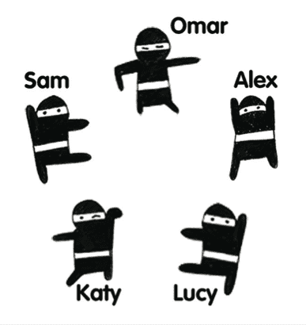
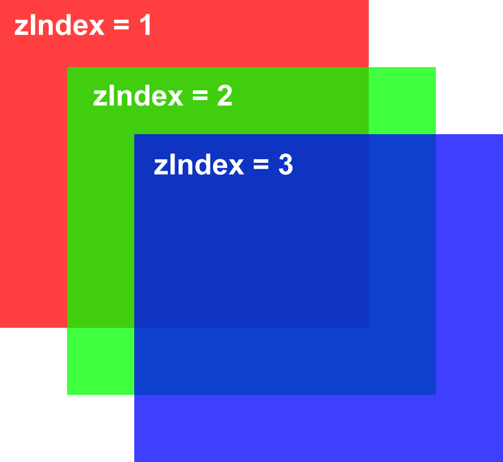
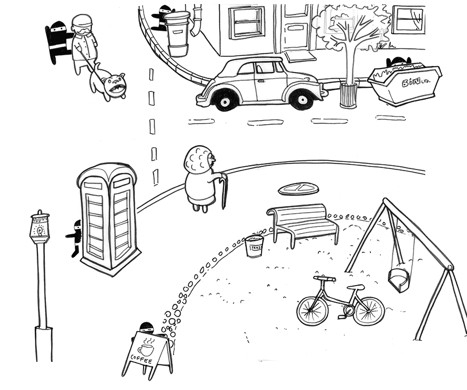

# Introduksjon {.intro}
Dette prosjektet vil utvide dine talenter i __CSS-kungfu__.

I denne oppgaven skal du lære hvordan du kan flytte rundt på elementer og gjemme elementene bak andre elementer ved hjelp av CSS.

Fem ninjaer kom til byen, og du må skjule dem før noen legger merke til dem. Ved å bruke dine egne ninja-liknende CSS-kunnskaper må du hjelpe dem å finne et sikkert gjemmested. Du kan flytte ninjaene selv, og noen objekter i gaten også. Fort – det er ingen tid å miste!



# Steg 1: Møt ninjaene {.activity}
- [ ] Last ned [ninja.zip](ninja.zip) og pakk ut filene på din datamaskin.

- [ ] Åpne filen kalt `ninjaer.html` i en teksteditor.
- [ ] Åpne `ninjaer.html` i nettleseren for å se hvordan den ser ut.
- [ ] Les gjennom koden. Kan du gjette hvilken del av koden som hører til delene i gatene? Legg merke til av vi bruker to språk her: `HTML` for å legge til elementene på siden, og `CSS` plassert mellom `<style>`-taggene.
- [ ] Elementene vi skal leke med er bildene, ``-taggen. Vi kan ta kontroll over deres plassering ved å bruke CSS.

**Kom igjen – La oss flytte en ninja!**

Alle ninjaene har fått eget navn ved bruk av `id` attributtet. La oss flytte "Alex The Ninja" først.
- [ ] Finn Alex sin CSS-stil.
- [ ] Endre verdien på `left`(venstre) til `100px` og `top` til `320px`.

Når `position` egenskapene er satt til `absolute` menes det at vi vil beskrive posisjonen i relasjon til foreldreelementet til ninjaen – I dette eksempelet `<div>` med `id` `gatehjoerne`.

`px` betyr `pixel`(punkter). `left` beskriver hvor langt fra venstrekanten ninjaen skal plasseres (antall pixler) og `top` forteller nettleseren hvor langt ninjaen skal flyttes ned fra toppen.

- [ ] Endre `left` til `right` og `top` til `bottom`. Nå vil koden fortelle nettleseren at den skal plassere ninjaen `100px` fra den høyre kanten og `320px` fra bunnen.

Pixel er en måleenhet som vi bruker til å forklare hvor stort et element skal være eller hvor det skal plasseres på siden. Hvis du endrer `right` fra `100px` til `101px`, så ser vi at den blir ikke flyttet veldig langt. Derfor gjør `pixler` det enklere for oss å designe nettsiden så detaljert vi vil.

# Steg 2: En annen måte å flytte på {.activity}

Nå vet du hvordan vi bruker pixel-posisjonering. Dette er ikke den eneste måten man kan beskrive plasseringer på skjermen, så la oss se på hva slags andre muligheter vi har. Vi skal nå se på hvordan vi kan bruke `%`, det ser slik ut:

```css
  #id{
    left: 100%;
    top: 100%;
  }
```

`100%` beskriver hele bredden som er tilgjengelig på skjermen. Når vi plasserer ninjaer og andre objekter i forhold til `gatehjornet`, som er 600 pixler bred, så vil 100% være lik `600px` i vårt eksempel. Hvis vi hadde laget et større gatehjørne, f.eks. 800 pixler bredt, ville `100%` bety en bredde på `800px`. Avhengig av sammenhengen så kan størrelsen beskrevet i prosenter(`%`) har forskjellige betydninger.

- [ ] Finn `soppelkasse`-elementet i CSSen.

- [ ] Bytt ut verdiene `190px` og `460px` i `soppelkasse`-elementet med prosenter sånn at søppelkassen står på ca. samme sted som den gjør nå. Trenger ikke være helt nøyaktig.


# Steg 3:  En størrelsetype til {.activity}

Som om vi ikke har nok størrelse-typer nå, skal vi likevel prøve en til! Du vet nå hvordan man skal bruke pixler (`px`) og prosent(`%`). La oss nå prøve `em`.

`Em` er en måleenhet som vi låner fra typografi, som er handler om utsende på bokstaver og tekst. Én `em` er det samme som den gjeldende skriftstørrelsen. Legg merke til at på toppen av CSS-en, definerte vi `font-size` i `body`-taggen som `20px`, så én `em` vil være `20px`.

- [ ] La oss teste dette ut, finn `body` i CSSen. Endre `font-size` verdien til `30px`. Hva skjedde?
- [ ] Studer koden og får å finne elementene som skal flytte på seg når `font-size` endres.
- [ ] Flytter de riktige elementene på seg?

Som dere ser når vi endre `em` til 30 pixler så endrer bredden og høyden seg til 30 pixels bred og 30 pixels høy på alle elementer som bruker denne verdien.

# Steg 4: Flytt figurer fremover {.activity}
Før vi skal begynne å gjemme ninjaene, skal vi studere én ting til: `z-index`.

- [ ] Let gjennom CSS-en og se om du finner `z-index`.

`Z-index` finner du to steder: i klassen `.ninja` og i id-en `#andre_gjenstander`. `Z-index` bestemmer hvilke element som ligger fremst på siden, altså hvilke element som skal ligge oppå de andre. Vi ser at `#andre_gjenstander` har en verdi på 200 og `.ninja` har en verdi på 1. Dette betyr at ninjaene vil legge seg bak elementene med høyere `z-index`-verdi.

Her er et bilde som beskriver `z-index`:

{width="30%"}

- [ ] Prøv å endre på `z-index`-verdien og se hva som skjer
- [ ] Legg til `z-index` på et element og se om du kan få elementet til å legge seg bak eller foran et annet

__Eksempel:__
```css
  #andre_objekter{
    z-index: 1;
  }

  .ninja{
    z-index: 2;
  }
```

- [ ] Bytt tilbake og forbered deg på redde ninjaene!

# Steg 5: Fort deg, skjul ninjaene!  {.activity}

- [ ] Se gjennom koden, finn ut hvilke elementer du kan hjemme ninjaene bak!
- [ ] Bruk det du har lært til å gjemme ninjaene

Her finnes det ingen fasit, så du må legge til og endre kode sånn at du får gjemt ninjaene! Sitter du fast bør du enten lese oppgaven på nytt eller prøve å finne hjelp på [w3schools.com](http://www.w3schools.com/css/default.asp). Det ligger også et eksempel nederst i denne oppgaven.

__LYKKE TIL!__

## Ting du kan prøve: {.challenge}
- [ ] Legg gjerne til `z-index` eller endre `position` i CSS-en på de elementene du føler trenger det
- [ ] Kan du finne ut hvordan du kan få ninjaene til å komme foran noen av gateobjektene? Hva skjer om du kopierer ``-taggen for ninjaen etter ``-taggen som viser objektet?
- [ ] Klarer du å legge til flere objekter på scenen? Du kan legge til bilder fra datamaskinen din, eller finne noen på internett.


## __Eksempel:__



<toggle>
<strong>Vis forslag til kode</strong>
  <hide>

  ```html
  <!DOCTYPE html>
<html>
<head>
 <meta charset=utf-8 />
 <title>Skjul ninjaene</title>
 <style>

   body {
     font-size: 20px;
   }

   #gatehjorne {
     width: 955px;
     height: 700px;
     margin-left: auto;
     margin-right: auto;
     background: url(gatehjorne.png);
     position: relative;
   }
   #andre_objekter {
     margin-left: auto;
     margin-right: auto;
     top: 0px;
     left: 0px;
     position: absolute;
     z-index: 200;
   }
   #kontainer {
     position: absolute;
     top: 14%;
     left: 73%;
     z-index: 2;
   }
   #soppelkasse {
     position: absolute;
     bottom: 190px;
     left: 460px;
   }
   #sykkel {
     position: relative;
     bottom: -520px;
     right: -20em;
   }
   #kafe_skilt {
     position: fixed;
     bottom: 2em;
     left: 11em;
     z-index: 2;
   }
   #kumlokk {
     position: fixed;
     bottom: 20em;
     left: 520px;
   }

   /* Ninjas */

   #lucy_the_ninja {
     position: fixed;
     top: 0px;
     left: 280px;
   }
   #alex_the_ninja {
     position: absolute;
     top: 90px;
     right: 140px;
   }
   #katy_the_ninja {
     position: relative;
     top: 380px;
     left: 6em;
   }
   #sam_the_ninja {
     position: static;
     top: 100px;
     left: 150px;
   }
   #omar_the_ninja {
     position: fixed;
     bottom: 100px;
     left: 250px;
   }
   .ninja {
     z-index: 1;
   }

   /* Other objects (you can't move these) */

 </style>
<style id="jsbin-css"></style></head>
<body>
 <div id="gatehjorne">

   
   
   
   
   


   
   
   
   
   

   

 </div>

<script>

</script>
</body>
</html>

  ```

  </hide>
</toggle>
