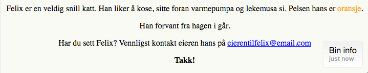

# Introduksjon {.intro}
Nå skal vi lære å endre på stilen til nettsider. I denne oppgaven forventer vi at du har gjort HTML-oppgavene eller er litt kjent med HTML fra før av.

<<<<<<< HEAD
Vi endrer hvordan en side ser ut gjennom å bruke et språk som heter __CSS__ (som står for __Cascading Style Sheets__). Det er et veldig enkelt språk å lære. La oss begynne.
=======
I denne og neste leksjon skal vi lære oss hvordan å __endre farge, tekst, størrelse og mer__!
>>>>>>> 3baa6cd... Web: Endringer i CSS: Style nettside

Vi endrer hvordan en side ser ut gjennom å bruke et språk som heter __CSS__ (som står for __Cascading Style Sheets__). Det er et veldig enkelt språk å lære, så la oss bare begynne!


# Steg 1: Hvordan fungerer CSS? {.activity}
Det finnes mange måter å lage stiler på, __inline__, i `<head>`, eller som en et eget .css-dokument som vi linker til fra `<head>`. Men i dag skal vi legge stilene i `<head>` på vår HTML-side så vi ikke trenger å tenke på å håndtere flere filer.

## Sjekkliste {.check}

+ Åpne index.html fra mappen Felix som vi lagde i oppgaven [Forvunnet katt](forsvunnet_katt/forsvunnet_katt.html) eller last ned filen ved å høyreklikke og trykk `lagre som`: [index.html](../forsvunnet_katt/ressurser/index.html). Lag en mappe som heter `Felix` og legg `index.html` i den.
+ I seksjonen `<head>` trenger vi en __style-tag__.
```html
 <style>
 </style>
```
Alle stiler skal legges mellom disse elementene. Generelt ser css-kode slik ut:

```css
selector {
  property: value;
}
```
Selektorer kan være html-element som `h1`, `p`, `img`, `a`. Men de kan også være andre ting som vi vil lære om senere. Propoerty og value skal vi se på i neste steg.


+ Kan du finne knappene for `{` og `}` på ditt tastatur? Hva med `:` og `;`? Finner du dem ikke, så få hjelp av noen til å finne dem for deg, fordi disse er viktige.

# Steg 2: Legg til farge {.activity}

Viste du at CSS er faktisk oppfunnet av en norsk gutt? Det er litt kult!

La oss legge til farge med hjelp av property-en `color`. La oss endre `h1` til å være rød istedenfor svart.

```html
<style>
  h1 {
      color:red;
    }
</style>
```

## __LAGRE__ filen og __VISE__ den i nettleseren din {.save}

Overskriften skal nå være rød! Det finnes forskjellige måter å representere en farge på. Det er 16 grunnleggende fargenavn, som er aqua, black, blue, fuchsia, gray, green, lime, maroon, navy, olive, purple, red, silver, teal, white, og yellow.

+ Prøv og endre fargen til noe annet!
De fleste nettlesere støtter i tillegg 130 andre fargenavn, hele listen i alfabetisk rekkefølge kan dere finne på
[http://www.w3.org/TR/css3-color/#svg-color](http://www.w3.org/TR/css3-color/#svg-color). Er din yndlingsfarge i listen?

+ Men vi kan bruke enda flere farger gjennom å bruke den heksadesimale koden istedenfor navnet. En heksadesimal kode er en `#` fulgt av 6 tegn der tegnen kan være sifferne 0-9 eller bokstavene A, B, C, D, E, F. Gjennom å bruke heksadesimale koder kan vi representere mer enn 16 millioner farger.

+ Kodeklubben sin favorittfarge er `#58AB57`. Kan du gjette hvilken farge det er? Prøv å endre noen tekst til den fargen og se hvordan det ser ut i en nettleser.

+ Prøve å endre teksten, `<p>`, på siden til denne fargen: `#58AB57`.

<toggle>
 <strong>Hint</strong>
 <hide>

  ```css
   p{
     color: #58AB57;
   }
   ```
   </hide>
</toggle>

+ Bruk [www.colourpicker.com](http://www.colourpicker.com) til å finne en farge du liker. Colourpicker genererer det nummer du trenger, så kan du enkelt klippe og lime det inn i koden din.

+ Finn en farge du liker med `Colourpicker` og endre teksten på siden til den fargen du fant.

## __LAGRE__ filen og __VISE__ den i nettleseren din {.save}

# Steg 3: Gi farge til spesifikke elementer {.activity}

Hva om vi vil gjøre sånn at ordet `oransje` i settningen `Pelsen hans er oransje` får oransje farge? Ikke hele seksjonen, men akkurat det ordet.

En måte å gjøre dette på er å putte taggen `<span>` rundt ordet, på denne måten:

```html
<span>oransje</span>
```

I `<head>` kan vi nå gjøre sånn at alle `<span>`-taggene blir oransje:

```css
span {
  color:orange;
}
```

## __LAGRE__ filen og __VISE__ den i nettleseren din {.save}

# Steg 4: La oss endre bakgrunnen {.activity}

Vi kan legge til farge på bakgrunnen også, ikke bare på tekst. For eksempel:

```css
body {
  background-color:#D2FAFC;
}
```

Dette vil gjøre at hele bakgrunnen blir blå.

Prøve nå:

```css
h1 {
  background-color:black;
}
```

Siden vi allerede hadde en `h1` deklarert i filen kan vi bare putte inn property-en `background-color` sammen med `color`, vi trenger ikke å skrive alt om igjen.

```css
h1 {
  color:red;
  background-color: black;
}
```
## Nå skal du __LAGRE__ filen og se hvordan det ser ut. {.save}

# Steg 5: Morro med tekst {.activity}
Kanskje skulle tittelen være __større__ og med store bokstaver. Vi kan spesifisere størrelsen på teksten gjennom å bruke `font-size`. Verdiene kan være forskjellige, men de mest brukte er 12, 14, 16, 32, 48 og 72 piksler.

+ La oss prøve ut `72px` for nå. (px betyr piksel)

```css
h1 {
  color:red;
  background-color:black;
  font-size:72px;
}
```

+ Nå skal du forsøke å endre tittelen til å være kun i store bokstaver bare gjennom å bruke `text-transform:uppercase;` Vi kan også gjøre den understreket gjennom å bruke `text-decoration:underline;`

## Nå skal du __LAGRE__ filen og se hvordan den ser ut. {.save}

Er det ikke mye større forskjell nå?


### For de som bruker Firefox eller Chrome som nettleser. {.try}
Det finnes faktisk også en annen verdi for `text-decoration` som er `blink`. Jeg kommer ikke til å fortelle deg hva det gjør. Du må teste det. `text-decoration:blink;` (det blir litt masete etterhvert, men det er lov å gå tilbake til “underline” hvis du vil).

# Steg 6: Sentrere tekst (og bilder) horisontalt {.activity}

All vår tekst vises helt borte til venstre. Vi kan endre det gjennom å bruke `text-align:center` (man kan også bruke `right`(høyre), `left`(venstre) er standard).
1. For denne nettsiden vil vi at all vår tekst skal være sentrert, og da kan vi skrive: (Merk deg at den engelske måten å stave senter på er center.)

```css
body {
  background-color: #F8FAF4;
  text-align: center;
}
```
La du merke til at alt på nettsiden ble sentrert når vi har lagt til `text-align:center` i seksjonen `<body>`? Det er fordi alt innenfor elementet `<body>` arver stilen. Dette skjer når et element er innenfor et annet, som dette her:

```html
<p>Har du sett Felix? <em>Vennligst</em> kontakt eieren hans</p>
```

Teksten *“Vennligst”* vil ha stilen fra elementet `<p>` med stilen fra elementet `<em>` lagt på. Dette er grunnen til at man kaller det __cascading__ - stilene blir videreført fra et element til alle ene som er innenfor dem.
Men vær forsiktig, det finnes noen stiler som ikke blir videreført.

## Nå skal du __LAGRE__ filen og åpne den i en nettleser {.save}

# Steg 7: Koden vi har til nå {.activity}
## Resultat:




## Koden:

```html
<!doctype html>
<html lang="no">
<head>
	<meta name="author" content="#">
	<meta charset="UTF-8">
	<meta name="description" content="En side laget for å finne katten Felix">
	<meta name="keywords" content="Felix, katt, forsvunnet">
	<title>Katten Felix er forsvunnet</title>

  <!---CSS-stilen til siden --->
  <style>

    body{
      background-color: #F8FAF4;
      text-align: center;
    }

    h1{
      color:red;
      background-color:black;
      font-size:72px;
      text-decoration: uppercase;
    }

    span {
      color:orange;
    }


  </style>

</head>

<body>
<!-- Dette er et Kodeklubb-prosjekt. Felix er ikke ekte og er egentlig ikke forsvunnet. -->
	<h1>Forsvunnet</h1>
	<h2>Katten Felix</h2>
	
	<p>Felix er en veldig snill katt. Han liker å kose, sitte foran varmepumpa og lekemusa si. Pelsen hans er <span>oransje</span>. </p>
	<p>Han forvant fra hagen i går.</p>
	<p>Har du sett Felix? Vennligst kontakt eieren hans på <a href="mailto:eierentilfelix@email.com">eierentilfelix@email.com</a></p>
	<p><strong>Takk!</strong><p>
</body>
</html>
```


## Videre studier {.try}

+ Hvordan ville du endret på siden for å få den til å se bedre ut? Hvorfor ikke prøve å bruke alle dine favorittfarger? Finnes din farge som et navn eller må du bruke en heksadesimal kode?
+ Hvis du blir fort ferdig kan du gå tilbake å legge på stiler for tidigere leksjoner.
