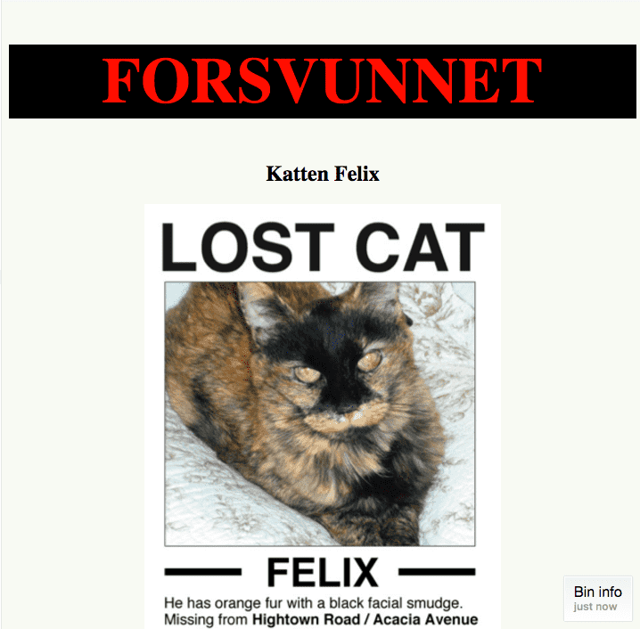
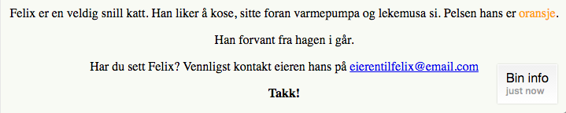

# Introduksjon {.intro}

No skal me lære å endre på stilen på nettsider. I denne oppgåva forventar me at
du har gjort HTML-oppgåvene (i oppgåvesamlinga _Intro til web_) eller er litt kjent med HTML frå før.

I denne og neste oppgåve skal me lære oss korleis du __endrar farge, tekst,
storleik og meir__! Dette gjer me ved å lære oss å bruke eit språk som heiter
__CSS__ (som står for __Cascading Style Sheets__). Det er eit veldig enkelt
språk å lære. La oss starte.

Resultatet kjem til å sjå ut som dette:






# Steg 1: Korleis fungerer CSS? {.activity}

Det finst mange måtar å lage stilar på. Ein av dei er __inline__ der du skriv
stilen rett inn i ein tag, som dette:

```html
<p style="color:red">Tekst som er raud</p>
```

Ein annan måte er å lage ei eiga `.css`-fil og referere til den i `<head>`:

```html
<head>
    <link rel="stylesheet" type="text/css" href="namn_på_css_filen_din.css">
</head>
```

I dag skal me bruke den siste metoden, nemleg å leggje stilane i `<head>` slik:

```html
<head>
    <style>
        /* Her skal me skrive CSS-en */
    </style>
</head>
```

På denne måten slepp me å handtere fleire filer, me kan ha alt me treng i éi
fil.

- [ ] Åpne `index.html` frå mappa `Felix` som me laga i oppgåva [Forvunne
  katt](../forsvunnet_katt/forsvunnet_katt_nn.html) eller last ned fila ved å
  høgreklikke og trykkje `lagre som`:
  [index.html](../forsvunnet_katt/ressurser/index_nn.html). Lag ei mappe som
  heiter `Felix` og legg `index.html` i den.

- [ ] I seksjonen `<head>` treng me ein __style-tag__.

```html
 <style>
 </style>
```

Alle stilar skal leggjast mellom desse elementa. Generelt ser CSS-kode slik ut:

```css
selector {
  property: value;
}
```

Selektorar kan vere HTML-element som `h1`, `p`, `img`, `a`, eller `id`-ar og
`klasser`, men desse skal me sjå på seinare. Selektorar brukast for å fortelje
CSS-en kva HTML-objekt me skal setje stil på. Kva stil selektoren får avhenger
av kva ein set som `property` og `value`.

`Property` eller `attributt` er gjerne ein eigenskap ein kan tildele selektoren,
saman med ein verdi, `value`. Døme på `property` og `value` kan vere `color:
blue;`, `background-color: red;` og ` font-family: "Times New Roman", Serif;`.

- [ ] Kan du finne knappane for `{` og `}` på tastaturet ditt?

- [ ] Kva med `:` og `;`?

Viss du ikkje finn dei må du få gjelp av nokon til å finne dei for deg, for
desse er viktige. Viss du ikkje har med `{ }`, `:`eller `;` på dei riktige
stadene, så vil ikkje HTML-koden din få stil. Difor er det viktig at du allereie
no veit kor du finn `{ }`, `:` og `;` på tastaturet.


# Steg 2: Legg til farge {.activity}

Visste du at CSS vart funne opp av ein norsk gut? Det er litt kult!

La oss endre `h1` til å vere `raud` i staden for `svart` ved hjelp av
_property_-en `color`:

```html
<style>
  h1 {
      color:red;
    }
</style>
```

__NB! Hugs å setje `;` etter `value`.__

__Lagre prosjektet ditt og åpne det i nettlesaren for å sjå korleis det ser
ut.__

Overskrifta di skal vere raud! Det finst ulike måtar å representere ei farge på.
Me har 16 grunnleggjande fargenamn: `aqua`, `black`, `blue`, `fuchsia`, `gray,
green`, `lime`, `maroon`, `navy`, `olive`, `purple`, `red`, `silver`, `teal`,
`white` og `yellow`.

- [ ] Prøv å endre farga til noko anna!

Dei fleste nettlesarar støttar i tillegg 130 andre fargenamn. Du finn heile
lista i alfabetisk rekkefølgje på
[http://www.w3.org/TR/css3-color/#svg-color](http://www.w3.org/TR/css3-color/#svg-color).
Er favorittfarga di i lista?

- [ ] Me kan bruke endå fleire farger gjennom å bruke den heksadesimale koden i
  staden for namnet. Ein heksadesimal kode er ein `#` etterfølgd av 6 teikn der
  teikna kan vere sifra 0-9 eller bokstavane A-F. Gjennom å bruke heksadesimale
  kodar kan me representere over 16 millionar farger.

- [ ] Kodeklubben sin favorittfarge er `#58AB57`. Kan du gjette kva farge det
  er? Prøv å endre noko tekst til den farga og sjå korleis det ser ut i ein
  nettlesar.

- [ ] Prøv å endre teksten, `<p>`, på sida til denne farga: `#58AB57`.

<toggle>
 <strong>Hint</strong>
 <hide>

  ```css
   p{
     color: #58AB57;
   }
   ```
   </hide>
</toggle>

- [ ] Bruk [www.colorpicker.com](http://www.colorpicker.com) til å finne ei
  farge du likar. Colorpicker genererer det nummeret du treng, så du kan enkelt
  klyppe og lime det inn i koden din.

- [ ] Finn ei farge du likar med _Colorpicker_ og endre teksten på sida til den
  farga du fann.

__Lagre prosjektet ditt og åpne det i nettlesaren for å sjå korleis det ser
ut.__


# Steg 3: Gi farge til spesifikke element {.activity}

Kva viss me vil gjere sånn at ordet `oransje` i setninga `Pelsen hans er
oransje` får oransje farge? Ikkje heile setninga, men akkurat det ordet. Då
brukar me ein tag som heiter `<span>`. Me legg taggen rundt ordet me vil setje
farge på slik:

```html
<span>oransje</span>
```

I `<head>` kan me no gjere alle `<span>`-taggane oransje slik:

```css
span {
  color:orange;
}
```

__Lagre prosjektet ditt og åpne det i nettlesaren for å sjå korleis det ser
ut.__


# Steg 4: La oss endre bakgrunnen {.activity}

Me kan leggje til farge på bakgrunnen òg, ikkje berre på teksten. Til dømes:

```css
body {
  background-color: #D2FAFC;
}
```

Dette vil gjere heile bakgrunnen blå.

Prøv no:

```css
h1 {
  background-color:black;
}
```

Sidan me allereie hadde ein `h1` deklarert i fila kan me berre setje inn
property-en `background-color` saman med `color`, me treng ikkje å skrive alt om
att.

```css
h1 {
  color:red;
  background-color: black;
}
```

__Lagre prosjektet ditt og åpne det i nettlesaren for å sjå korleis det ser
ut.__

Legg merke til at berre bakgrunnen til `h1` blir svart, og ikkje heile sida. For
å få heile sida svart må me leggje til bakgrunnsfarge på `body`, som vist over.


# Steg 5: Moro med tekst {.activity}

Kanskje tittelen burde vere __større__ og med store bokstavar. Me kan
spesifisere storleiken på teksten ved å bruke `font-size`. Verdiane kan vere
ulike, men dei mest brukte er 12, 14, 16, 32, 48 og 72 pikslar.

- [ ] La oss prøve ut `72px` for no (px står for piksel).

```css
h1 {
  color:red;
  background-color:black;
  font-size:72px;
}
```

- [ ] No skal du prøve å endre tittelen slik at heile står i blokkbokstavar ved
  å bruke `text-transform:uppercase;`. Me kan gjere den understreka ved å bruke

  ```
  text-decoration:underline;
  ```

__Lagre prosjektet ditt og åpne det i nettlesaren for å sjå korleis det ser
ut.__

Vart det veldig forskjellig?

### For dei som brukar Firefox eller Chrome som nettlesar. {.challenge}

Det finst ein annan verdi for `text-decoration`, `blink`. Du får ikkje vite kva
den gjer her, du må teste det sjølv. Prøv å leggje til `text-decoration:blink;`
(det blir fort litt masete, men det er lov å gå tilbake til `underline` viss du
vil).


# Steg 6: Sentrere tekst (og bilete) horisontalt {.activity}

All teksten vår visast heilt borte til venstre. Me kan endre det gjennom å bruke
`text-align:center` (ein kan bruke `right` (høgre) og `left` (venstre) òg).

1. For denne nettsida vil me at all teksten skal vere sentrert. Då kan me
  skrive:

```css
body {
  background-color: #F8FAF4;
  text-align: center;
}
```

Merk at den engelske måten å stave senter på er `center`.

La du merke til at alt på nettsida vart sentrert når me har lagt til
`text-align:center` i seksjonen `<body>`? Det er fordi alt innanfor elementet
`<body>` får stilen. Dette skjer når eit element er innanfor eit anna, som dette
her:

```html
<p>Har du sett Felix? <em>Ver snill</em> og kontakt eigaren hans</p>
```

Teksten *"Ver snill"* vil ha stilen frå elementet `<p>` med stilen frå elementet
`<em>` lagt på. Det er grunnen til at språket har namnet __cascading__ - stilane
blir vidareført frå eit element til alle elementa som er inni det. Men ver
forsiktig, nokre stilar blir *ikkje* vidareført!

__Lagre prosjektet ditt og åpne det i nettlesaren for å sjå korleis det ser
ut.__


# Steg 7: Koden me har til no {.activity}

## Resultat:


## Koden:

```html
<!doctype html>
<html lang="no">
<head>
    <meta name="author" content="#">
    <meta charset="UTF-8">
    <meta name="description" content="Ei side laga for å finne katten Felix">
    <meta name="keywords" content="Felix, katt, forsvunne">
    <title>Katten Felix er forsvunne</title>

  <!---CSS-stilen til sida --->
  <style>

    body{
      background-color: #F8FAF4;
      text-align: center;
    }

    h1{
      color:red;
      background-color:black;
      font-size:72px;
      text-decoration: uppercase;
    }

    span {
      color:orange;
    }


  </style>

</head>

<body>
<!-- Dette er eit Kodeklubb-prosjekt. Felix er ikkje ekte og er ikkje borte. -->
    <h1>Forsvunne</h1>
    <h2>Katten Felix</h2>
    
    <p>Felix er ein veldig snill katt. Han likar å kose, sitje framfor
      varmepumpa og leikemusa si. Pelsen hans er <span>oransje</span>. </p>
    <p>Han forvann frå hagen i går.</p>
    <p>Har du sett Felix? Ver snill og kontakt eigaren hans på <a
      href="mailto:eigarentilfelix@email.com">eigarentilfelix@email.com</a></p>
    <p><strong>Takk!</strong></p>
</body>
</html>
```

## Vidare arbeid {.challenge}

- [ ] Korleis ville du endra på sida for å få den til å sjå betre ut? Kvifor
  ikkje prøve å bruke alle favorittfargane dine? Finst farga di som eit namn,
  eller må du bruke ein heksadesimal kode?

- [ ] Viss du blir fort ferdig kan du gå attende og leggje på stilar for
  oppgåver du har gjort før.
