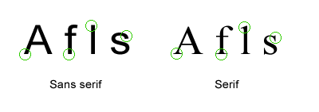
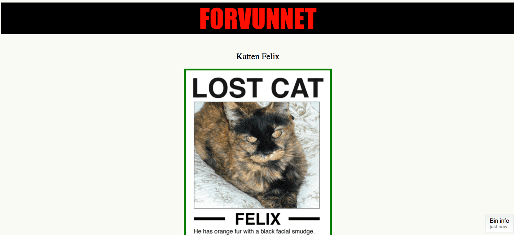
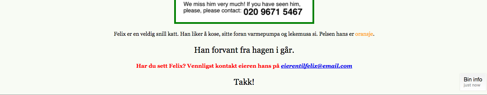

# Introduksjon {.intro}
I denne oppgaven skal vi jobbe videre med skrift, størrelser og farger. Vi skal utforske forskjellige skrifttyper, se på bakgrunnsfarger og vi skal sette CSS på bilder.

Denne oppgaven bygger på forrige oppgave, [CSS: Style nettsider](../style_nettsider/style_nettsider.html), så hvis du ikke har gjort den, så anbefaler jeg det siden vi skal fortsette på koden derfra. Evt så kan du kopiere koden som ligger nederst på siden til [CSS: Style nettsider](../style_nettsider/style_nettsider.html).

# Steg 1: Fonter og tekst-stiler {.activity}

Vi kan forandre utseende på teksten ved å endre __skrifttypen__ eller __fonten__ som det også heter. De mest vanlige fontene heter:

* Arial
* Courier New, Courier
* Garamond
* Georgia
* Lucida Sans, Lucida Grande, Lucida
* Palatino Linotype
* Tahoma
* Times New Roman, Times
* Trebuchet
* Verdana

Ikke alle fonter finnes på alle datamaskiner, så vi trenger å angi en __reserve font__ også. Det skal vi se på etterpå.

En font har en stil, de som blir oftest brukt er `sans serif` eller `serif`. Under kan du se forskjellen på `sans serif` og `serif`. Som du ser er det ikke store forskjellen, men det utgjør en liten forskjell for leseren, noen er lettere å lese enn andre.



La oss prøve å endre fonten på overskriften ved å bruke `font-family` egenskapene. Dersom du ikke har `index.html` fra [CSS: Style nettsider](../style_nettsider/style_nettsider.html), så kan du hente koden ved å kopiere den nederst i *CSS: Style nettsider*-oppgaven.

- [ ] Legg til `font-family` med en font du ønsker på overskriften på nettsiden din. Under har vi brukt fonten `impact` med `sans-serif`-stil, du kan godt velge en annen.

__Merk!__ i CSS-en har vi `font-family: font, skriftstil`. Altså har vi navnet på fonten, etterfulgt av hvilken stil vi vil at den skal være, `sans-serif` eller `serif`.

```css
h1 {
  color: red;
  background-color: black;
  font-size: 72px;
  text-transform: uppercase;
  text-decoration: underline;
  text-decoration: blink;
  font-family: impact, sans-serif;
}
```
- [ ] Nå skal du endre fonten for alle paragrafer (`<p>`).

```css
p {
  font-family: georgia, 'times new roman', serif;
}
```

Som du ser over så står det to skirfttyper etter hverandre, `georgia` og `times new roman`. Dette forteller CSS-en at `georgia` er nettsidens førstevalg og dersom denne fonten ikke finnes på maskinen til personen som åpner nettsiden, så velger den `times new roman`. `Times new roman` blir derfor __reserver fonten__.

## __Lagre__ og __se__ det i nettleseren. {.save}

Prøv nå med forskjellige fonter og se hvilke du liker best. Legg merke til at hvis navnet på fonten består av flere ord så må navnet skrives inn i anførselstegn, som `"times new roman"`.

- [ ] Hvilken av fontene i listen over synes du er finest?
- [ ] Hvilken font og skrift-stil synes du er enklest å lese?

Har du en annen font på din datamaskin som ikke er nevnt over? (Det har du helt sikkert). Prøv å åpne programmet Word eller Pages, der kan du se alle fontene du har på datamaskinen.


+ Hvis du finner en du liker så prøv om du kan bruke den på nettsiden!

Du kan også lage teksten i __fet__, *kursiv* eller begge deler ved hjelp av font-stilegenskaper. La oss forandre epostteksten (husk at den finner vi inne i a-taggen).


```css
a {
  font-weight: bold;
}
```

## __Lagre__ og __se__ det i nettleseren. {.save}

Eller vi kan sette teksten til *kursiv*.

```css
a {
  font-style: italic;
}
```
## __Lagre__ og __se__ det i nettleseren. {.save}

- [ ] Det er også en font-stil-verdi (`font-style`) som heter ‘oblique’. Hvordan ser den ut?

Vi kan til og med bestemme hvor fet skriften skal være ved å bruke egenskapen `font-weight`. Den bruker verdier som `normal`, `bold`, `bolder`, `lighter`. Du kan også bruke tall som 100, 200, 300, 400, 500, 600, 700, 800, og 900, hvor 100 er den tynneste og 900 er den tykkeste. Normal tekst er det samme som verdien 400, fet er det samme som 700. Derimot så har ikke alle fonter alle disse verdiene. Så for å være på den sikre siden, er det lurt å bruke `normal` eller `bold` osv. Overskrifter er normalt satt til fet skrift som standard. Men hvis du for eksempel ikke ønsker at `h2` ikke skal være fet, må vi skrive følgende:

```css
h2 {
  font-weight: normal;
}
```

__Prøv det!__

# Step 2: Kantlinjer! {.activity}

La oss legge til en kantlinje eller en ramme rundt et bilde.

```css
img {
  border-color: green;
  border-width: 5px;
  border-style: solid;
}
```
`border-color` bestemmer hvilken farge rammen eller kantlinjen rundt bildet skal ha.

`border-width` er tykkelsen på rammen som går rundt bildet.

`border-style` er stilen på linjen, denne kan også være: `dashed`, `dotted`, `double`, `groove`, `ridge`, `inset`, `outset`.

## __Lagre__ og __se__ det i nettleseren. {.save}


- [ ] Prøv å forandre farge på rammen (her kan du godt bruke heksadesimaler som vi brukte i [CSS: Style nettsider](../style_nettsider/style_nettsider.html)).
- [ ] Prøv å forandre bredden på rammen.
- [ ] Prøv å forandre linje-stil til rammen.

__Fant du en stil du liker?__

## Ting å prøve ut {.challenge}

- [ ] Du kan sette på kantlinjer på alle slags elementer. Prøv å sett kantlinjer på de andre elementene på siden din.

# Step 3: IDer og klasser {.activity}

Vi ønsker å lage et kontaktavsnitt som er __uthevet__. Vi kan ikke bruke `<p>` tag fordi det vil endre alle andre paragrafer også. For å gjøre dette må vi legge til en stil for de paragrafene vi vil skal være __uthevet__. For å gjøre dette kan vi bruke noe som kalles `ID`. Denne IDen gjør at vi kun endrer stil på de taggene som har samme ID. Vi trenger da å endre HTML-koden vår sånn at den ser slik ut:

```html
<p id="uthevet">Har du sett Felix? Vennligst kontakt eieren hans på <a href="mailto:eierentilfelix@email.com">eierentilfelix@email.com</a></p>
```
- [ ] La oss gjøre den __uthevet__ og sette en farge på teksten.

Ved å sette stil på en `ID` bruker vi `#` foran ID-navnet i CSS-en:
```css
#uthevet {
  font-weight: bold;
  color: red;
}
```
## __Lagre__ og __se__ det i nettleseren. {.save}

En ID er unik og kan bare bli brukt en gang per side. Så hva gjør vi hvis du ønsker å lage to paragrafer med større skrift? Dette kan vi løse ved å bruke klasser. Det første vi må gjøre er å gi paragrafene et klassenavn, litt på samme måte som å sette en `ID` bare at vi bruker `class`.

```html
<p class="stor">Han forvant fra hagen i går.</p>
<p class="stor"><strong>Takk!</strong><p>
```

Deretter setter vi stilen slik at tekten er større for alle paragrafer med `class="stor"` (legg merke til at vi bruker `.` i stedet for `#`):

```css
.stor {
  font-size: 24px;
}
```

- [ ] Legg til en kant rundt klassen `.stor` og IDen `#uthevet`.
- [ ] Skift font og skrift-stil på klassen `.stor` og IDen `#uthevet`.


Sammen kan du gjøre med `<div>`- og `HTML5`-taggene vi brukte i oppgaven [HTML: Del inn nettsiden](../del_inn_nettsiden/del_inn_nettsiden.html).

## Ting du kan prøve: {.challenge}

- [ ] Hvordan vil du endre siden for å få den til å se bedre ut? Hvorfor ikke prøve å bruke din favorittskrifttype, farge, osv? Bruk gjerne [w3schools.com/css](http://www.w3schools.com/css/) for å utforske CSS-ens verden.

- [ ] Hvis du er tidlig ferdig. Gå tilbake og legg på en stil i HTML dokumentet fra forrige leksjon.

- [ ] Forresten, visste du at egenskapene for bakgrunn, ikke bare lar deg endre farger, men også legge til et bilde? ([Hint: w3schools.com/css - background-image](http://www.w3schools.com/cssref/pr_background-image.asp))

# Eksempel på hvordan det kan se ut {.activity}

## Eksempel på hvordan siden kan se ut:

{width="100%"}
{width="100%"}


## Koden for eksempelet over:

```html
<!doctype html>
<html lang="no">
<head>
	<meta name="author" content="#">
	<meta charset="UTF-8">
	<meta name="description" content="En side laget for å finne katten Felix">
	<meta name="keywords" content="Felix, katt, forsvunnet">
	<title>Katten Felix er forsvunnet</title>

  <!--- CSSen for siden -->
  <style>

    body{
      background-color: #F8FAF4;
      text-align: center;
    }

    h1{
      color:red;
      background-color:black;
      font-size:72px;
      text-transform: uppercase;
      text-decoration: underline;
      text-decoration: blink;
      font-family: impact, sans-serif;
    }

    h2{
      font-weight: normal;
    }

    p {
      font-family: georgia, 'times new roman', serif;
    }

    img {
      border-color: green;
      border-width: 5px;
      border-style: solid;
    }

    span {
      color:orange;
    }

    a {
      font-weight: bold;
      font-style: italic;
    }

    #uthevet{
      font-weight: bold;
      color: red;
    }

    .stor{
      font-size: 24px;
    }
  </style>

</head>
<body>
<!-- Dette er et Kodeklubb-prosjekt. Felix er ikke ekte og er egentlig ikke forsvunnet. -->
	<h1>Forvunnet</h1>
	<h2>Katten Felix</h2>
	
	<p>Felix er en veldig snill katt. Han liker å kose, sitte foran varmepumpa og lekemusa si. Pelsen hans er <span>oransje</span>. </p>
	<p class="stor">Han forvant fra hagen i går.</p>
	<p id="uthevet">Har du sett Felix? Vennligst kontakt eieren hans på <a href="mailto:eierentilfelix@email.com">eierentilfelix@email.com</a></p>
	<p class="stor">Takk!<p>
</body>
</html>
```
