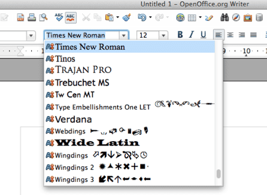

# Introduksjon {.intro}
I denne oppgaven skal vi se på og lære hvordan vi kan forandre skrifttyper, farge og størrelse. Vi skal også lære hvordan vi kan legge til en bakgrunnsfarge og ramme. Vi vil fortsette å bruke det samme prosjektet som i [forrige oppgave](../forsvunnet_katt/forsvunnet_katt.html). Så vi må være sikre på at vi har åpnet filen index.html fra mappen Felix.

# Steg 1: Skrifttyper  {.activity}

Vi kan forandre utseende på teksten ved å endre __skrifttypen__. De mest vanlige skrifttypene heter:

* Arial
* Courier New, Courier
* Garamond
* Georgia
* Lucida Sans, Lucida Grande, Lucida
* Palatino Linotype
* Tahoma
* Times New Roman, Times
* Trebuchet
* Verdana

Ikke alle skrifttyper finnes på alle datamaskiner, så vi trenger å angi en __reserve skrifttype__ også. Den som blir oftest bruker er ‘sans serif’ eller ‘serif’.

La oss prøve å endre skrifttyper på overskriften ved å bruke `font-family` egenskapene:

```css
h1 {
  color: red;
  background-color: black;
  font-size: 72px;
  text-transform: uppercase;
  text-decoration: underline;
  text-decoration: blink;
  font-family: impact, sans-serif;
}
```
Og nå – endre skrifttypen i en paragraf...

```css
p {
  font-family: georgia, 'times new roman', serif;
}
```

## __Lagre__ og __se__ det i nettleseren. {.save}

Prøv nå med forskjellige skrifttyper som du liker best. Legg merke til at vi kan skille mellom hver skrifttype ved å bruke komma, og hvis navnet på skrifttypen består av flere ord – må navnet skrives inn i anførselstegn.

Hvilken av skrifttypene som står listet over synes du er finest? Hvilken skrifttype synes du er enklest å lese?

Har du en annen skrifttype på din datamaskin som ikke er nevnt over? (Det har du helt sikkert). Prøv å åpne programmet Word eller Pages, alle skrifttypene som er på datamaskinen kan du finne der.



Finn en du liker og prøv om du kan legge den ut på websiden!
Du kan også lage teksten i __fet__, *kursiv* eller begge deler ved hjelp av skrifttype-stilegenskaper. La oss forandre epostteksten (husk at den finner vi inne i a-taggen)


```css
a {
  font-weight: bold;
}
```

## __Lagre__ og __se__ det i nettleseren. {.save}

Eller vi kan sette teksten til *kursiv*.

```css
a {
  font-style: italic;
}
```
## __Lagre__ og __se__ det i nettleseren. {.save}

Det er også en skriftstil-verdi som heter ‘oblique’. Hvordan ser den ut?

Vi kan til og med bestemme hvor fet skriften skal være ved å bruke egenskapen font-weight-. Den bruker verdier som `normal`, `bold`, `bolder`, `lighter`. Du kan også bruke tall som 100, 200, 300, 400, 500, 600, 700, 800, og 900, hvor 100 er den tynneste skrifttypen og 900 er den tykkeste (feteste skriften). Normal tekst er det samme som verdien 400, fet er det samme som 700. Derimot så har ikke alle skrifttyper alle disse verdiene. Så for å være på den sikre siden, er det lurt å bruke normal- eller fet- skrift. Overskrifter er normalt satt til fet skrift som standard. Men hvis du for eksempel ikke ønsker at `h2` ikke skal være fet, må vi skrive følgende:

```css
h2 {
  font-weight: normal;
}
```

Prøv det!

# Step 2: Kantlinjer! {.activity}

LLa oss legge til en kantlinje rundt et bilde.

```css
img {
  border-color: green;
  border-width: 5px;
  border-style: solid;
}
```
## __Lagre__ og __se__ det i nettleseren. {.save}

Prøv nå å forandre farge, bredden, og linje-stil til du er fornøyd. Her er noen linje-stiler: `dashed`, `dotted`, `double`, `groove`, `ridge`, `inset`, `outset`.

Du kan sette på kantlinjer på alle slags elementer, vi prøver litt mer.

# Step 3: IDer og klasser {.activity}

Vi ønsker å lage et kontaktavsnitt som er __uthevet__. Vi kan ikke bruke `<p>` tag fordi det vil endre alle andre paragrafer også. For å gjøre dette må vi legge til en stil for disse egenskapene. For å lage denne stilen må vi lage noe som kalles en ID. Vi trenger da følgende HTML:

```html
<p id="uthevet">Har du sett Felix? Vennligst kontakt eieren hans på <a href="mailto:eierentilfelix@email.com">eierentilfelix@email.com</a></p>
```
Nå kan vi endre stilen til IDen slik:

```css
#uthevet {
  color: red;
}
```
## __Lagre__ og __se__ det i nettleseren. {.save}
En ID er unik og kan bare bli brukt en gang per side. Så hva gjør vi hvis du ønsker å lage to paragrafer med større skrift? Dette kan vi løse ved å bruke klasser. Det første vi må gjøre er å gi teksten klassenavnet for den teksten vi ønsker å gjøre større.

```html
<p class="stor">Han forvant fra hagen i går.</p>
<p class="stor"><strong>Takk!</strong><p>
```

Deretter setter vi stilen slik (legg merke til at vi bruker `.` i stedet for `#`):

```css
.stor {
  font-size: 24px;
}
```

## Ting du kan prøve: {.try}

+ Hvordan vil du endre siden for å få den til å se bedre ut? Hvorfor ikke prøve å bruke din favorittskrifttype, farge, osv?

+ Hvis du er tidlig ferdig. Gå tilbake og legg på en stil i HTML dokumentet fra forrige leksjon.

+ Forresten, visste du at egenskapene for bakgrunn, ikke bare lar deg endre farger, men også legge til et bilde?
