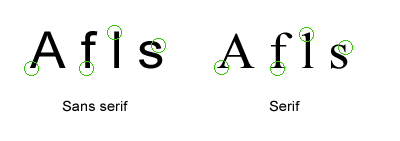
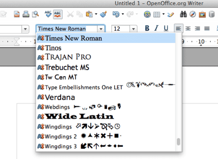

# Introduksjon {.intro}

I denne oppgåva skal me jobbe vidare med skrift, storleikar og fargar. Me skal
utforske ulike skrifttypar, sjå på bakgrunnsfargar og me skal setje CSS på
bilete.

Denne oppgåva byggjer på førre oppgåve, [CSS: Style
nettsider](../style_nettsider/style_nettsider_nn.html), så viss du ikkje har
gjort den anbefalar me å gjere den fyrst. Me skal nemleg fortsetje på koden frå
den oppgåva. Eventuelt kan du kopiere koden som ligg nedst på sida der.


# Steg 1: Fontar og tekststiler {.activity}

Me kan endre utsjånaden på teksten ved å endre __skrifttypen__ eller __fonten__
som det heiter. Dei mest vanlege fontane heiter:

- Arial

- Courier New, Courier

- Garamond

- Georgia

- Lucida Sans, Lucida Grande, Lucida

- Palatino Linotype

- Tahoma

- Times New Roman, Times

- Trebuchet

- Verdana

Det er ikkje alle fontar som finst på alle datamaskiner, så me bør alltid gi ein
__reservefont__ òg. Det skal me sjå på etterpå.

Ein font har ein stil, dei som oftast blir brukt er `sans serif` eller `serif`.
Under kan du sjå skilnaden på `sans serif` og `serif`. Som du ser er det ikkje
store skilnaden, men det utgjer ein liten forskjell for lesaren, nokon er
enklare å lese enn andre.



La oss prøve å endre fonten på overskrifta ved å bruke
`font-family`-eigenskapane. Viss du ikkje har `index.html` frå [CSS: Style
nettsider](../style_nettsider/style_nettsider_nn.html) kan du hente koden ved å
kopiere den frå nedst i *CSS: Style nettsider*-oppgåva.

- [ ] Legg til ein font du vil ha på overskrifta på nettsida di i `font-family`.
  Under har me brukt fonten `impact` med `sans-serif`-stil, men du kan godt
  velje ein annan.

__Merk!__ I CSS-en har me `font-family: font, skriftstil`. Altså har me namnet
på fonten, etterfølgd av kva stil me vil at den skal ha, `sans-serif` eller
`serif`.

```css
h1 {
  color: red;
  background-color: black;
  font-size: 72px;
  text-transform: uppercase;
  text-decoration: underline;
  text-decoration: blink;
  font-family: impact, sans-serif;
}
```

- [ ] No skal du endre fonten for alle avsnitt (`<p>`).

```css
p {
  font-family: georgia, 'times new roman', serif;
}
```

Som du ser over står det to skrifttypar etter kvarandre, `georgia` og `times new
roman`. Dette fortel CSS-en at `georgia` er førstevalet, og viss denne ikkje
finst på maskina til personen som åpnar nettsida, så skal den velje `times new
roman`. `Times new roman` blir difor __reservefonten__.

__Lagre prosjektet ditt og åpne det i nettlesaren for å sjå korleis det ser
ut.__

Prøv med ulike fontar og sjå kven du likar best. Legg merke til at viss namnet
på fonten består av fleire ord, så må du skrive namnet i hermeteikn, som `"times
new roman"`.

- [ ] Kven av fontane i lista over synest du er finast?

- [ ] Kva font og skriftstil synest du er enklast å lese?

Du har heilt sikkert andre fontar på datamaskina di enn dei som er nemnt over.
Prøv å åpne programmet Word eller Pages og sjå alle fontane du har på
datamaskina di.



- Viss du finn ein du likar, prøv om du kan bruke den på nettsida!

Du kan òg lage teksten som __feit__, *kursiv* eller begge delar ved hjelp av
font-stileigenskapar. La oss forandre epostteksten (hugs at me finn den inne i
a-taggen).

```css
a {
  font-weight: bold;
}
```

__Lagre prosjektet ditt og åpne det i nettlesaren for å sjå korleis det ser
ut.__

Me kan setje teksten til *kursiv*.

```css
a {
  font-style: italic;
}
```

__Lagre prosjektet ditt og åpne det i nettlesaren for å sjå korleis det ser
ut.__

- [ ] Det er òg ein font-stil-verdi (`font-style`) som heiter "oblique". Korleis
  ser den ut?

Me kan til og med bestemme kor feit skrifta skal vere ved å bruke eigenskapen
`font-weight`. Den brukar verdiar som `normal`, `bold`, `bolder`, `lighter`. Du
kan òg bruke tal som 100, 200, 300, 400, 500, 600, 700, 800, og 900, der 100 er
den tynnaste og 900 er den tjukkaste. Normal tekst er det same som verdien 400,
feit er det same som 700. Derimot har ikkje alle fontar desse verdiane. Så for å
vere på den sikre sida er det lurt å bruke `normal` eller `bold` og så
bortetter. Overskrifter er vanlegvis sett til feit skrift som standard. Men viss
du til dømes ikkje ynskjer at `h2` ikkje skal vere feit må du skrive følgjande:

```css
h2 {
  font-weight: normal;
}
```

__Prøv det!__


# Steg 2: Kantlinjer! {.activity}

La oss leggje til ei kantlinje eller ei ramme rundt eit bilete.

```css
img {
  border-color: green;
  border-width: 5px;
  border-style: solid;
}
```

`border-color` bestemmer kva farge ramma eller kantlinja rundt biletet skal ha.

`border-width` er tjukkleiken på ramma som går rundt biletet.

`border-style` er stilen på linja. Denne kan òg vere: `dashed`, `dotted`,
`double`, `groove`, `ridge`, `inset`, `outset`.

__Lagre prosjektet ditt og åpne det i nettlesaren for å sjå korleis det ser
ut.__

- [ ] Prøv å forandre farge på ramma (her kan du godt bruke heksadesimalar som
  me brukte i [CSS: Style
  nettsider](../style_nettsider/style_nettsider_nn.html)).

- [ ] Prøv å forandre breidda på ramma.

- [ ] Prøv å forandre linjestilen til ramma.

__Fann du ein stil du likar?__

## Ting å prøve ut {.challenge}

- [ ] Du kan setje på kantlinjer på alle slags element. Prøv å setje kantlinjer
  på dei andre elementa på sida di.


# Steg 3: ID-ar og klasser {.activity}

Me ynskjer å lage eit kontaktavsnitt som er __utheva__. Me kan ikkje bruke
`<p>`-taggen fordi det vil endre alle andre avsnitt òg. For å gjere det må me
leggje til ein stil for dei paragrafane me vil at skal vere __utheva__. For å
gjere dette kan me bruke noko som kallast `ID`. Denne ID-en gjer at me berre
endrar stil på dei taggane som har same ID. Me må endre HTML-koden vår så den
ser slik ut:

```html
<p id="utheva">Har du sett Felix? Ver snill og kontakt eigaren hans på <a href="mailto:egarentilfelix@email.com">eigarentilfelix@email.com</a></p>
```

- [ ] La oss gjere den __utheva__ og setje ei farge på teksten.

Ved å setje stil på ein `ID` brukar vi `#` framfor ID-namnet i CSS-en:

```css
#utheva {
  font-weight: bold;
  color: red;
}
```

__Lagre prosjektet ditt og åpne det i nettlesaren for å sjå korleis det ser
ut.__

Ein ID er unik og kan berre bli brukt ein gong per side. Så kva gjer me viss du
vil ha to avsnitt med større skrift? Det kan du løyse ved å bruke klasser. Det
fyrste me må gjere er å gi avsnitta eit klassenamn, litt på same måte som me
sette ein `ID`, men no brukar me `class`.

```html
<p class="stor">Han forsvann frå hagen i går.</p>
<p class="stor"><strong>Takk!</strong></p>
```

Så set me stilen slik at teksten er større for alle avsnitt med `class="stor"`
(legg merke til at me brukar `.` i staden for `#`):

```css
.stor {
  font-size: 24px;
}
```

- [ ] Legg til ein kant rundt klassa `.stor` og ID-en `#utheva`

- [ ] Skift font og skrift-stil på klassa `.stor` og ID-en `#utheva`.

Det same kan du gjere med `<div>`- og `HTML5`-taggane me brukte i oppgåva [HTML:
Del inn nettsida](../del_inn_nettsiden/del_inn_nettsiden_nn.html).

## Ting du kan prøve {.challenge}

- [ ] Korleis vil du endre sida for å få den til å sjå betre ut? Kanskje du kan
  prøve å bruke favorittskrifttypen din, favorittfarga di og så bortetter? Bruk
  gjerne [w3schools.com/css](http://www.w3schools.com/css/) for å utforske
  CSS-verda.

- [ ] Viss du er tidleg ferdig kan du gå tilbake og leggje på ein stil i
  HTML-dokumentet frå førre oppgåve.

- [ ] Forresten, visste du at eigenskapane for bakgrunn ikkje berre let deg
  endre farger, men òg å leggje til eit bilete? [Hint: w3schools.com/css -
  background-image](http://www.w3schools.com/cssref/pr_background-image.asp)


# Døme på korleis det kan sjå ut {.activity}

## Døme på korleis sida kan sjå ut

{width="100%"}

{width="100%"}

## Koden for dømet over:

```html
<!doctype html>
<html lang="no">
<head>
    <meta name="author" content="#">
    <meta charset="UTF-8">
    <meta name="description" content="Ei side laga for å finne katten Felix">
    <meta name="keywords" content="Felix, katt, forsvunne">
    <title>Katten Felix er forsvunne</title>

  <!--- CSSen for sida -->
  <style>

    body{
      background-color: #F8FAF4;
      text-align: center;
    }

    h1{
      color:red;
      background-color:black;
      font-size:72px;
      text-transform: uppercase;
      text-decoration: underline;
      text-decoration: blink;
      font-family: impact, sans-serif;
    }

    h2{
      font-weight: normal;
    }

    p {
      font-family: georgia, 'times new roman', serif;
    }

    img {
      border-color: green;
      border-width: 5px;
      border-style: solid;
    }

    span {
      color:orange;
    }

    a {
      font-weight: bold;
      font-style: italic;
    }

    #utheva{
      font-weight: bold;
      color: red;
    }

    .stor{
      font-size: 24px;
    }
  </style>

</head>
<body>
<!-- Dette er eit Kodeklubb-prosjekt. Felix er ikkje ekte og er ikkje borte. -->
    <h1>Forvunne</h1>
    <h2>Katten Felix</h2>
    
    <p>Felix er ein veldig snill katt. Han likar å kose, sitje framfor
      varmepumpa og leikemusa si. Pelsen hans er <span>oransje</span>. </p>
    <p class="stor">Han forvann frå hagen i går.</p>
    <p id="utheva">Har du sett Felix? Ver snill og kontakt eigaren hans på <a
      href="mailto:eigarentilfelix@email.com">eigarentilfelix@email.com</a></p>
    <p class="stor">Takk!</p>
</body>
</html>
```
