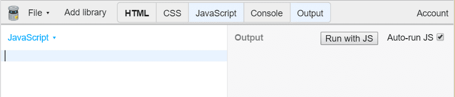
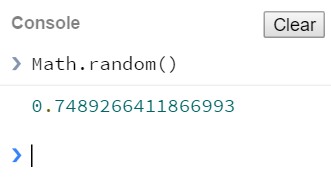
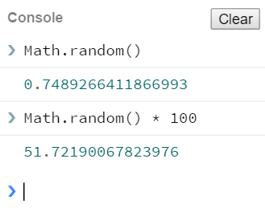
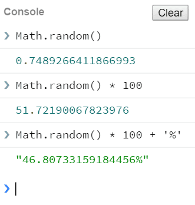
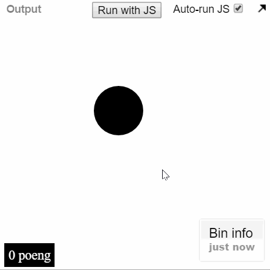
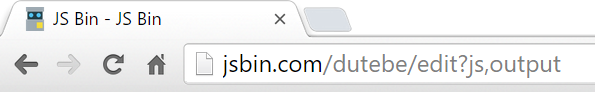

# Introduksjon {.intro}
Denne oppgaven viser deg hvordan du kan lage et spill med JavaScript og dele det med vennene dine. Spillet kalles *Trykkomania* fordi det handler om å trykke på en ball flest mulig ganger før tiden renner ut.


# Steg 1: Åpne JS Bin {.activity}
Vi skal bruke JS Bin (http://jsbin.com) for å lage spillet. Hvis du aldri har brukt JS Bin før, ta en titt på oppgaven [Hei JavaScript](../hei_js/hei_js.html).

## Sjekkliste {.check}
- Åpne adressen [jsbin.com](http://jsbin.com) i ett eget vindu.
- Velg å vise **JavaScript** og **Output**. Skjul de andre fanene ved å trykke på de.

  

- I **JavaScript** skriver vi koden.
- I **Output** vises websiden.
- Når du starter er begge fanene tomme.

# Steg 2: Lage en ball {.activity}
Vi skal bruke JavaScript til å lage innholdet på websiden. Dette betyr at vi skal bruke JavaScript til å lage *HTML*. Du trenger ikke kunne noe spesielt om HTML, men om du ønsker lære om HTML, se [oppgaven Internett](../internett/internett.html).

## Sjekkliste {.check}
- Vi begynner med å lage en funksjon som heter `Ball`:

  ```js
  function Ball() {

  }
  ```

- Inni funksjonen lager vi ett nytt `div`-element:

  ```js
  function Ball() {
    var el = document.createElement('div');
  }
  ```

- `var el` betyr at elementet får navn `el`.
- Vi kan nå gi elementet en stil:

  ```js
  function Ball() {
    var el = document.createElement('div');
    el.style.backgroundColor = 'black';
    el.style.width = '60px';
    el.style.height = '60px';
  }
  ```

- `el.style.backgroundColor = 'black'` gjør ballen svart.
- `el.style.width = '60px'` gjør ballen 60 [piksler](https://no.wikipedia.org/wiki/Piksel) bred.
- `el.style.height = '60px'` gjør ballen 60 piksler høy.
- La oss legge ballen til siden:

  ```js
  function Ball() {
    var el = document.createElement('div');
    el.style.backgroundColor = 'black';
    el.style.width = '60px';
    el.style.height = '60px';
    document.body.appendChild(el);
  }
  ```

- For at ballen skal vises, må vi kjøre koden:

  ```js
  Ball();
  ```

- Vises en "ball" i **Output**?

  

- Ok, så den var ikke akkurat rund. Vi kan bruke `el.style.borderRadius` for å runde av hjørnene.
- Siden ballen er `60px` bred og høy, så avrunder vi kantene med `30px`, altså halvparten av 60.
- Legg koden under de andre `el.style`-setningene:

  ```js
  el.style.borderRadius = '30px';
  ```

- Fikk du en rund ball?

## Utforsk {.challenge}
Om du ønsker en annen form, prøv andre verdier enn `30px` for avrundingen. Hvordan ser `5px` ut?

## Tips {.protip}
Om du sitter fast, kan du se på [fasiten så langt](http://jsbin.com/pozova/1/edit?js,output).

# Steg 3: Flytte ballen {.activity}
Akkurat nå vises ballen helt øverst til venstre i **Output**. La oss flytte den rundt omkring.

Vi bruker `el.style.position = 'fixed'` for å fortelle at vi ønsker plassere ballen i forhold til kantene i vinduet. 50% fra toppen blir da `el.style.top = '50%'`.

## Sjekkliste {.check}
- Legg til en posisjon for ballen:

  ```js
  el.style.position = 'fixed';
  el.style.top = '80%';
  ```

- Flyttet ballen seg ned?
- Flytt ballen ut fra venstre kant:

  ```js
  el.style.left = '30%';
  ```

- Prøv verdier mellom `0%` og `100%`.
- Når forsvinner ballen vekk fra vinduet?

## Tips {.protip}
Om du sitter fast, kan du se på [fasiten så langt](http://jsbin.com/pozova/2/edit?js,output).

# Steg 4: Flytte ballen med en funksjon {.activity}
Ettersom vi ønsker at ballen skal flytte seg underveis i spillet, skal vi lage en funksjon som flytter ballen.

## Sjekkliste {.checklist}
- Inni `Ball`, lag en funksjon som heter `el.posisjon`.

  ```js
  function Ball() {
    ...
    el.posisjon = function (x, y) {

    };
  }
  ```

- Funksjonen skal bestemme `el.style.top` og `el.style.left`.

   ```js
   el.posisjon = function (x, y) {
     el.style.left = x;
     el.style.top = y;
   };
   ```

- Returner `el`, slik at vi kan bruke funksjonene til ballen.

  ```js
  function Ball() {
    ...
    el.posisjon = function (x, y) {
      el.style.left = x;
      el.style.top = y;
    };

    return el;
  }
  ```

- Du kan nå flytte ballen slik som dette:

  ```js
  var ball = Ball();  // lager ballen
  ball.posisjon('10%', '20%');  // flytter til x = 10% og y = 20%
  ```

## Tips {.protip}
Om du sitter fast, kan du se på [fasiten så langt](http://jsbin.com/hipepuy/edit?js,output).

# Steg 5: Velg en tilfeldig plassering {.activity}
I JavaScript kan vi bruke `Math.random()` for å få en tilfeldig verdi mellom 0 og 1. La oss bruke denne til å plassere ballen.

## Sjekkliste {.check}
- Trykk på fanen **Console**.
- Skriv inn `Math.random()` og trykk enter.

  

- Fikk du et tall mellom 0 og 1?
- Vi kan gjøre dette tallet om til prosent ved å gange med 100, prøv det ut:

  

- Vi kan legge til prosenttegnet med `+ '%'`:

  

- Legg merke til at hver gang kommandoen kjøres, får vi nye tall. Det er dette som kalles *tilfeldig*.
- Lukk **Console** ved å trykke på den.
- La oss bruke `Math.random` til å plassere ballen:

  ```js
  var x = Math.random() * 100 + '%';
  var y = Math.random() * 100 + '%';
  ball.posisjon(x, y);
  ```

- Hvis du trykker på knappen <button>Run with JS</button>, flytter ballen på seg?

  

- Hvis du har haket av **Auto-run JS** vil også koden kjøres hver gang du endrer koden.
- Trykker du nok antall ganger, legger du merke til at ballen noen ganger kommer utenfor bunnen og høyre side.
- For å unngå dette kan vi begrense forflytningen til 80%:

  ```js
  var x = Math.random() * 80 + '%';
  var y = Math.random() * 80 + '%';
  ```

- Siden `Math.random()` maksimalt er 1 og vi ganger med 80, vil aldri ballen flytte seg lenger ut fra toppen eller venstre side enn 80%.

## Tips {.protip}
Om du sitter fast, kan du se på [fasiten så langt](http://jsbin.com/digiqa/1/edit?js,output).

# Steg 6: Flytte ballen hvert andre sekund {.activity}
Vi ønsker at ballen hele tiden skal flytte seg. Nå skal vi bruke `setInterval` til å flytte ballen hvert andre sekund.

## Sjekkliste {.check}
- Bruk `setInterval` til å flytte ballen hvert andre sekund:

  ```js
  setInterval(function () {
    var x = Math.random() * 80 + '%';
    var y = Math.random() * 80 + '%';
    ball.posisjon(x, y);
  }, 2000);
  ```

- `setInterval(function ..., 2000)` betyr kjør `function` hvert `2000` millisekund.
- 2000 millisekund er 2 sekunder, altså tegnes ballen på et nytt sted hvert andre sekund.

## Tips {.protip}
Om du sitter fast, kan du se på [fasiten så langt](http://jsbin.com/lecamej/1/edit?js,output).

# Steg 7: Poeng {.activity}
Nå har du en ball som spretter rundt. La oss legge til poeng. Vi har laget en poeng-komponent som du kan bruke, så kommer du raskere i gang. `Poeng` er bygd opp likt som `Ball`, så du må gjerne lese gjennom og se om du forstår den.

## Sjekkliste {.check}
- Legg til koden for komponenten `Poeng`:

  ```js
  /**
   * Poeng - viser poengsum nede i venstre hjørne.
   *
   * Bruk:
   *   var poeng = Poeng();  // viser poengsummen
   *   poeng.øk();  // øker poengsummen med 100
   *   poeng.nullstill();  // setter poengsummen til 0
   *
   */
  function Poeng() {
    var el = document.createElement('div');
    el.style.position = 'fixed';
    el.style.bottom = '5px';
    el.style.left = '8px';
    el.style.padding = '5px';
    el.style.backgroundColor = 'black';
    el.style.color = 'white';

    var _poeng = 0;
    el.innerHTML = _poeng + ' poeng';
    document.body.appendChild(el);

    el.øk = function () {
      _poeng += 100;
      el.innerHTML = _poeng + ' poeng';
    };
    el.nullstill = function () {
      _poeng = 0;
      el.innerHTML = _poeng + ' poeng';
    };

    return el;
  }
  ```

- For at poengsummen skal vises, må vi kjøre `Poeng()` en gang, slik vi også gjorde med `Ball()`.
- Legg denne linjen over `Ball()`:

  ```js
  var poeng = Poeng();
  var ball = Ball();
  ```

- Vises "**Poeng 0**"?
- For å holde orden på programmet er det lurt å ha det som skjer i toppen. Funksjoner kan brukes likevel om de ikke står først, så flytt `function Ball` og `function Poeng` ned til bunnen.

  ```js
  var poeng = Poeng();
  var ball = Ball();
  setInterval(function () {
    ...
  }, 2000);


  function Ball() {
    ...
  }

  function Poeng() {
    ...
  }
  ```

- Nå står det som skjer i toppen:
  - Vis poengene: `var poeng = Poeng()`
  - Vis ballen: `var ball = Ball()`
  - Flytt ballen hvert andre sekund: `setInterval(..., 2000)`
- Vi velger nå å kjøre funksjonen `poeng.øk` hver gang ballen trykkes.

  ```js
  ball.onclick = poeng.øk;
  ```
  **Obs:** Det skal **ikke** være `()` på slutten av `poeng.øk`. Dette er fordi funksjonen ikke kjøres her, men hver gang noen klikker på ballen.

- `ball.onclick = poeng.øk;` betyr at funksjonen `poeng.øk()` kjøres når noen klikker på ballen.
- Sjekk at du får poeng når du treffer ballen med et klikk.

  

## Tips {.protip}
Om du sitter fast, kan du se på [fasiten så langt](http://jsbin.com/mewole/1/edit?js,output).

## Teste spillet {.flag}
Du er nå kommet så langt at det kan være kult å teste spillet. Ettersom spillet handler om å trykke flest mulig ganger på ballen, egner det seg for å prøve på mobiltelefonen.

## Sjekkliste {.check}
- Noen mobiltelefoner zoomer når en dobbeltklikker på skjermen, derfor skal vi slå av zooming.
- Åpne fanen **HTML** ved å trykke på den.
- Finn linjen med `<meta name="viewport" ...`.
- Endre linjen til:

  ```html
  <meta name="viewport" content="width=device-width, user-scalable=no">
  ```

- Lukk fanen **HTML** ved å trykke på den.
- Øverst i nettleseren din står adressen til siden.

  

- Adressen du trenger å taste inn på mobilen er det *før* `/edit?js,output`.
- I eksempelet over er adressen `jsbin.com/dutebe`.
- Tast *din* adresse inn på mobiltelefonen.
- Spill!

# Steg 8: Begrense tiden {.activity}
Akkurat nå er det ubegrenset tid i spillet. La oss legge til en nedtelling av tid, slik at man kan konkurrere om hvem som klarer flest klikk på 10 sekunder.

## Sjekkliste {.check}
- Legg til koden for nedtelling i bunnen av programmet.

  ```js
  /**
   * Nedtelling - En linje som viser at tiden renner ut.
   *
   * Bruk:
   *   var nedtelling = Nedtelling(slutt);  // funksjonen `slutt` kjøres når tiden er utløpt
   *   nedtelling.tellNed(10);  // teller ned 10 sekunder
   *
   */
  function Nedtelling (ferdig) {
    var el = document.createElement('div');
    el.style.position = 'fixed';
    el.style.left = '0';
    el.style.bottom = '0';
    el.style.height = '100%';
    el.style.width = '3px';
    el.style.backgroundColor = 'red';
    document.body.appendChild(el);

    function prosent (slutt, tid) {
      return (slutt - Date.now()) / tid / 10;
    }
    el.tellNed = function (tid) {
      var slutt = Date.now() + tid * 1000;
      var intervall = setInterval(tegn, 20);
      function tegn () {
        var p = prosent(slutt, tid);
        if (p < 0) {
          el.style.height = '0%';
          clearInterval(intervall);
          ferdig();
        }
        el.style.height = p + '%';
      }
    }

    return el;
  }
  ```

- I toppen starter vi nedtellingen.

  ```js
  var nedtelling = Nedtelling();
  nedtelling.tellNed(10);
  ```

- Dette lager en nedtelling på 10 sekunder.
- Hvis du trykker på <button>Run with JS</button> ser du nedtellingen, men ingenting skjer når tiden er ute.
- Lag funksjonen `stopp` som forteller hva som skal skje når tiden er ute.

  ```js
  function stopp() {
    ball.skjul();
  }
  ```

- Vi har ikke laget funksjonen `ball.skjul` enda. Vi trenger `ball.vis` også.
- Lag `ball.skjul` og `ball.vis` inni `function Ball`.

  ```js
  function Ball() {
    ...
    el.skjul = function () {
      el.style.display = 'none';
    };
    el.vis = function () {
      el.style.display = '';
    };

    return el;
  }
  ```

- Nå kan vi fortelle nedtellingen at den skal kjøre `stopp()` når tiden er ute.

  ```js
  var nedtelling = Nedtelling(stopp);
  ```

- Forsvinner ballen når tiden er ute?
- Hvor mange poeng klarer du på mobiltelefonen innen tiden?

## Tips {.protip}
Om du sitter fast, kan du se på [fasiten så langt](http://jsbin.com/tukiwu/1/edit?js,output).

# Steg 9: Omstarte spillet {.activity}
Så langt kan spillet omstartes ved å oppdatere nettleseren. Er det ikke stiligere med en knapp som starter spillet?

## Sjekkliste {.check}
- Lag en funksjon `start`.

  ```js
  function start() {

  }
  ```

- Funksjonen skal bestemme hva som skjer når spillet skal starte. Vi må nullstille poengsummen, vise nedtellingen og vise ballen.

  ```js
  function start() {
    poeng.nullstill();
    nedtelling.tellNed(10);
    ball.vis();
  }
  ```

- `start` skal kjøres hver gang en knapp klikkes, så vi trenger en knapp.
- Legg til koden for knappen i bunnen av programmet.

  ```js
  /**
   * En knapp som ligger midt på siden.
   *
   * Bruk:
   *   var knapp = Knapp('trykk på meg');  // lager en knapp som ligger midt på siden
   *   knapp.vis();  // viser knappen
   *   knapp.skjul();  // skjuler knappen
   */
  function Knapp(tekst) {
    var el = document.createElement('button');
    el.style.display = 'none';
    el.innerText = tekst;
    el.style.position = 'fixed';
    el.style.top = '50%';
    el.style.left = '50%';
    el.style.padding = '20px';
    el.style.border = 'solid 1px';
    document.body.appendChild(el);

    el.skjul = function () {
      el.style.display = 'none';
    };
    el.vis = function () {
      el.style.display = '';
      // plasser akkurat på midten
      // midten av skjermen er 50% minus halvparten av størrelsen til knappen
      var w = el.offsetWidth / 2;
      var h = el.offsetHeight / 2;
      el.style.marginLeft = '-' + w + 'px';
      el.style.marginTop = '-' + h + 'px';
    };

    return el;
  }
  ```

- I toppen legger vi til knappen.

  ```js
  var knapp = Knapp('Prøv en gang til');
  knapp.onclick = start;
  ```

- `knapp.onclick` bestemmer hva som skal skje når knappen klikkes.
- Knappen vises ikke, så vi må bestemme at den skal vises når spillet er slutt.

  ```js
  function stopp() {
    ...
    knapp.vis();
  }
  ```

- Vises knappen når spillet er ferdig?
- Du legger kanskje merke til at vi har en bug nå? Vi må jo skjule knappen når spillet startes også!
- Skjul knappen når spillet startes.

  ```js
  function start() {
    ...
    knapp.skjul();
  }
  ```

- Spillet er nå ferdig! Del adressen med dine venner og se hvem som klarer flest poeng.

## Tips {.protip}
Om du sitter fast, kan du se på [fasiten](http://jsbin.com/pozova/11/edit?js,output).

## Utfordringer {.challenge}
Her er noen utfordringer:
- Endre størrelsen på ballen, slik at spillet blir vanskeligere.
- Endre hvor lang tid man har på seg.
- Endre fargen på ballen.
- Øk poengsummen med 1000 istedenfor 100.
