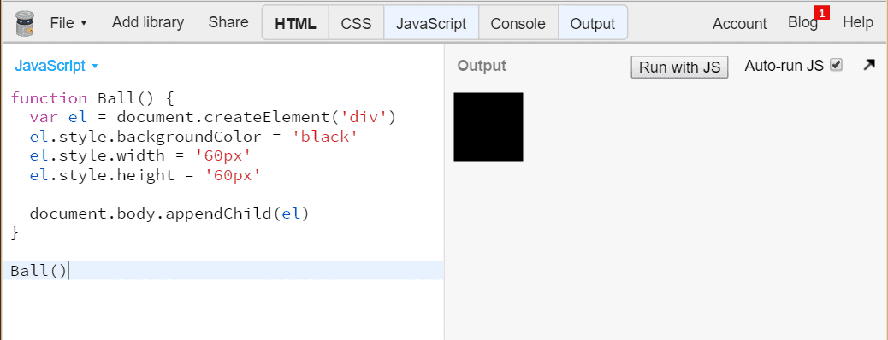
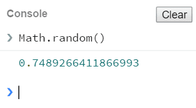
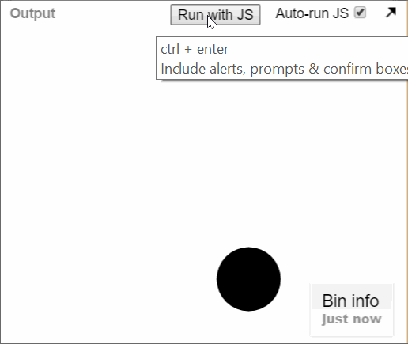

# Introduksjon {.intro}
Denne oppgaven viser deg hvordan du kan lage et spill med JavaScript og dele det med vennene dine. Spillet har blitt kallt *Trykkomania* fordi det handler om å trykke på en ball flest mulig ganger før tiden renner ut.


# Steg 1: Åpne JS Bin {.activity}
Vi skal bruke JS Bin (http://jsbin.com) for å lage spillet. Hvis du aldri har brukt JS Bin før, ta en titt på oppgaven [Hei JavaScript](../hei_js/hei_js.html).

## Sjekkliste {.check}
- Åpne adressen [jsbin.com](http://jsbin.com) i ett eget vindu.
- Velg å vise **JavaScript** og **Output**.

  

- I **JavaScript** skriver vi koden.
- I **Output** vises websiden.
- Når du starter er begge fanene tomme.

# Steg 2: Lage en ball {.activity}
Vi skal bruke JavaScript til å lage innholdet på siden, altså vi lager *HTML* fra JavaScript. Du trenger ikke kunne noe spesielt om HTML, men om du ønsker lære om HTML, se [oppgaven Internett](../internett/internett.html).

## Sjekkliste {.check}
- Vi begynner med å lage en funksjon som heter `Ball`:

  ```js
  function Ball() {

  }
  ```

- Inni funksjonen lager vi ett nytt `div`-element:

  ```js
  function Ball() {
    var el = document.createElement('div')
  }
  ```

- `var el` betyr at elementet får navn `el`.
- Vi kan nå gi elementet en stil:

  ```js
  function Ball() {
    var el = document.createElement('div')
    el.style.backgroundColor = 'black'
    el.style.width = '60px'
    el.style.height = '60px'
  }
  ```

- `el.style.backgroundColor = 'black'` gjør ballen svart.
- `el.style.width = '60px'` gjør ballen 60 [piksler](https://no.wikipedia.org/wiki/Piksel) bred.
- `el.style.height = '60px'` gjør ballen 60 piksler høy.
- La oss legge ballen til siden:

  ```js
  function Ball() {
    var el = document.createElement('div')
    el.style.backgroundColor = 'black'
    el.style.width = '60px'
    el.style.height = '60px'
    document.body.appendChild(el)
  }
  ```

- For at ballen skal vises, må vi kjøre koden:

  ```js
  Ball()
  ```

- Vises en "ball" i **Output**?

  

- Ok, så den var ikke akkurat rund. Vi kan bruke `el.style.borderRadius` for å runde av hjørnene.
- Siden ballen er `60px` bred og høy, så avrunder vi kantene med `30px`, altså halvparten av 60.
- Legg koden under de andre `el.style`-setningene:

  ```js
  el.style.borderRadius = '30px'
  ```

- Fikk du en rund ball?

## Utfordring {.challenge}
Om du ønsker en annen form, kan du gjerne bruke andre verdier enn `30px` for avrundingen. Hvordan ser `5px` ut?

# Steg 3: Flytte ballen {.activity}
Akkurat nå vises ballen helt øverst til venstre i **Output**. La oss flytte den rundt omkring.

Vi bruker `el.style.position = 'fixed'` for å fortelle at vi ønsker plassere ballen i forhold til kantene i vinduet. 50% fra toppen blir da `el.style.top = '50%'`.

## Sjekkliste {.check}
- Legg til en posisjon for ballen:

  ```js
  el.style.position = 'fixed'
  el.style.top = '80%'
  ```

- Flyttet ballen seg ned?
- Flytt ballen ut fra venstre kant:

  ```js
  el.style.left = '30%'
  ```

- Prøv verdier mellom `0%` og `100%`. Når forsvinner ballen vekk fra viduet?

# Steg 4: Velg en tilfeldig plassering {.activity}
I JavaScript kan vi bruke `Math.random()` for å få en tilfeldig verdi mellom 0 og 1. La oss bruke denne til å plassere ballen.

## Sjekkliste {.check}
- Trykk på fanen **Console**.
- Skriv inn `Math.random()` og trykk enter.

  

- Fikk du et tall mellom 0 og 1?
- Vi kan gjøre dette tallet om til prosent ved å gange med 100, prøv det ut:

  

- Vi kan legge til prosenttegnet med `+ '%'`:

  

- Legg merke til at hver gang kommandoen kjøres, får vi nye tall. Det er dette som kalles *tilfeldig*.
- La oss lage en funksjon av *oppskriften*:

  ```js
  function tilfeldig () {
    return Math.random() * 100 + '%'
  }
  ```

- Her betyr `return` at funksjonen sender tilbake verdien. La oss prøve det ut.
- I **Console**, skriv `tilfeldig()`:

  

- La oss bruke `tilfeldig()` til å plassere ballen:

  ```js
  el.style.top = tilfeldig()
  el.style.left = tilfeldig()
  ```

- Dette er det samme som om vi hadde skrevet:

  ```js
  el.style.top = Math.random * 100 + '%'
  el.style.left = Math.random * 100 + '%'
  ```

  Derfor laget vi `tilfeldig`, slik at vi koden blir enklere å lese.

- Hvis du nå trykke på knappen <button>Run</button>, flytter ballen på seg?

  

- Trykker du nok antall ganger, legger du merke til at ballen noen gang kommer utenfor bunnen og høyre side.
- For å unngå dette kan vi begrense `tilfeldig`:

  ```js
  function tilfeldig () {
    return Math.random() * 80 + '%'
  }
  ```

- Siden `Math.random()` maks er 1 og vi ganger med 80, vil aldri ballen flytte seg lenger ut enn 80% fra toppen eller venstre side.

# Steg 5: Flytte ballen hvert sekund {.activity}
Vi ønsker at ballen hele tiden skal flytte seg. Nå skal vi bruke `setInterval` til å flytte ballen hvert andre sekund.

## Sjekkliste {.check}
- Flytt `el.style.left` og `el.style.top` inni en funksjon vi kaller `tegn`:

  ```js
  function Ball() {
    var el = document.createElement('div')
    el.style.backgroundColor = 'black'
    el.style.width = '60px'
    el.style.height = '60px'
    el.style.borderRadius = '30px'
    el.style.position = 'fixed'
    document.body.appendChild(el)

    function tegn () {
      el.style.top = tilfeldig()
      el.style.left = tilfeldig()
    }
  }
  ```

- Vi kan nå bruke `tegn` for å flytte ballen til et tilfeldig sted.
- La oss bruke `tegn` med `setInterval`. Legg denne linjen etter `tegn`-funksjonen:

  ```js
  setInterval(tegn, 2000)
  ```

- `setInterval(tegn, 2000)` betyr kjør `tegn` hvert `2000` millisekund. 2000 millisekund er 2 sekunder, altså tegnes ballen på et nytt sted hvert andre sekund.

# Steg 6: Poeng {.activity}
Nå har du en ball som spretter rundt. La oss legge til poeng. Vi har laget en poeng-komponent som du kan bruke, så kommer du raskere i gang. `Poeng` er bygd opp likt som `Ball`, så du må gjerne lese gjennom og se om du forstår den.

## Sjekkliste {.check}
- Legg til `Poeng` koden:

  ```js
  /**
  * Poeng - viser poengsum nede i venstre hjørne.
   *
   * Bruk:
   *   var poeng = Poeng()
   *   poeng.ink()  // øker poengsummen med 100
   *   poeng.nullstill()  // setter poengsummen til 0
   */
  function Poeng () {
    var el = document.createElement('div')
    el.style.position = 'fixed'
    el.style.bottom = '5px'
    el.style.left = '8px'
    el.style.padding = '5px'
    el.style.backgroundColor = 'black'
    el.style.color = 'white'

    var poeng = 0
    el.innerHTML = poeng + ' poeng'
    document.body.appendChild(el)

    function ink () {
      poeng += 100
      el.innerHTML = poeng + ' poeng'
    }
    function nullstill () {
      poeng = 0
      el.innerHTML = poeng + ' poeng'
    }

    return { ink: ink, nullstill: nullstill }
  }
  ```

- For at poengsummen skal vises, må vi kjøre `Poeng()` en gang, slik vi også gjorde med `Ball()`.
- Legg denne linjen over `Ball()`:

  ```js
  var poeng = Poeng()
  Ball()
  ```

- For å holde orden på programmet er det lurt å ha det som skjer i toppen. Funksjoner kan brukes likevel om de ikke står først, så flytt `function Ball`, `function tilfeldig` og `function Poeng` ned til bunnen.
- Nå står det som skjer i toppen, vis poengene, `var poeng = Poeng()` og vis ballen, `Ball()`.
- Vi må nå utvide `Ball` slik at vi kan registrere når ballen blir trykt på:

  ```js
  function Ball (handtereKlikk) {
  ```

  Og `el.onclick` like over `appendChild`:

  ```js
  el.onclick = handtereKlikk
  document.body.appendChild(el)
  ```

- Det som er nytt er at vi tar i mot `handtereKlikk`, som skal være en funksjon.
- Og `el.onclick = handtereKlikk` betyr at denne funksjonen kjøres når ballen klikkes.
- Det siste som gjenstår er å sende funksjonen `poeng.ink` til `Ball`:

  ```js
  var poeng = Poeng()
  Ball(poeng.ink)  // kjør poeng.ink hver gang ballen klikkes
  ```

- Sjekk nå at du får poeng når du treffer ballen med et klikk.

  
