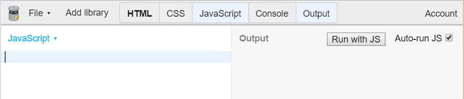
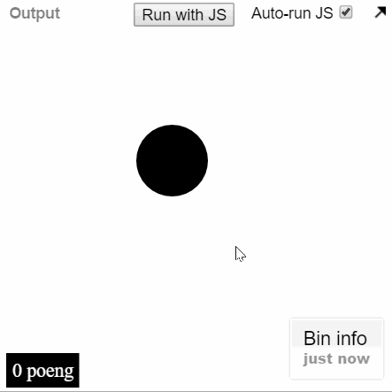

# Introduksjon {.intro}

Denne oppgåva viser deg korleis du kan lage eit spel med JavaScript og dele det
med venene dine. Spelet heiter *Trykkomania* fordi det handlar om å trykke på
ein ball flest mogleg gonger før tida renn ut.

Før du startar med denne oppgåva bør du ha ein del erfaring med variablar,
funksjonar og eventListeners i JavaScript. Viss du ikkje har det anbefalar me at
du gjer nokre av dei enklare oppgåvene fyrst.


# Steg 1: Åpne JS Bin {.activity}

Me skal bruke JS Bin (http://jsbin.com) for å lage spelet. Viss du ikkje har
brukt JS Bin før bør du ta ein kikk på oppgåva [Hei,
JavaScript](../hei_js/hei_js_nn.html). Viss du heller vil lage spelet i ei eiga
fil på PC-en din, så kan du åpne favoritt-teksteditoren din og hoppe til steg 2.

## Sjekkliste {.check}

- [ ] Åpne adressa [jsbin.com](http://jsbin.com) i eit nytt vindauge.

- [ ] Vel å vise **JavaScript** og **Output**. Skjul dei andre fanene ved å
  trykkje på dei.

  

- [ ] I **JavaScript** skriv me koden.

- [ ] I **Output** vidast nettsida.

- [ ] Når du startar er begge fanene tomme.


# Steg 2: Lage ein ball {.activity}

Me skal bruke JavaScript til å lage innhaldet på nettsida. Dette tyder at me
skal bruke JavaScript til å lage HTML. Du treng ikkje kunne noko spesielt om
HTML, men viss du vil lære meir om det fyrst kan du sjå på oppgåva [Introduksjon
til web](../introduksjon_til_web/introduksjon_til_web_nn.html).

## Sjekkliste {.check}

- [ ] Me startar med å lage ein funksjon som heiter `Ball`:

  ```js
  function Ball() {

  }
  ```

- [ ] Inne i funksjonen lagar me eit nytt `div`-element:

  ```js
  function Ball() {
    var el = document.createElement('div');
  }
  ```

- [ ] `var el` tyder at elementet får namnet `el`.

- [ ] No kan me gi elementet ein stil:

  ```js
  function Ball() {
    var el = document.createElement('div');
    el.style.backgroundColor = 'black';
    el.style.width = '60px';
    el.style.height = '60px';
  }
  ```

- [ ] `el.style.backgroundColor = 'black'` gjer ballen svart.

- [ ] `el.style.width = '60px'` gjer ballen 60
  [pikslar](https://no.wikipedia.org/wiki/Piksel) brei.

- [ ] `el.style.height = '60px'` gjer ballen 60 pikslar høg.

- [ ] La oss leggje til ballen på sida:

  ```js
  function Ball() {
    var el = document.createElement('div');
    el.style.backgroundColor = 'black';
    el.style.width = '60px';
    el.style.height = '60px';
    document.body.appendChild(el);
  }
  ```

- [ ] For at ballen skal visast må me køyre funksjonen ved hjelp av denne koden:

  ```js
  Ball();
  ```

- [ ] Ser du ein "ball" i **Output**?

  

Så ballen vår er ikkje akkurat rund. Me kan bruke `el.style.borderRadius` for å
runde av hjørnene. Sidan ballen er `60px` brei og høg, så avrundar me kantane
med `30px`, altså halvparten av sidekanten.

- [ ] Legg koden under dei andre `el.style`-setningane:

  ```js
  el.style.borderRadius = '30px';
  ```

- [ ] Fekk du ein rund ball?

## Utforsk {.challenge}

Viss du ynskjer ei anna form, prøv andre verdiar enn `30px` for avrundinga.
Korleis ser det ut med `5px`?

## Tips {.protip}

Viss du sit fast kan du sjå på [koden så
langt](http://jsbin.com/pozova/1/edit?js,output).


# Steg 3: Flytte ballen {.activity}

Akkurat no visast ballen heilt øvst til venstre i **Output**. La oss flytte den
rundt omkring.

Me brukar `el.style.position = 'fixed'` for å fortelje at me ynskjer å plassere
ballen i forhold til kantane i vindauget. Halvparten (`50 %`) frå toppen blir då
`el.style.top = '50%'`.

## Sjekkliste {.check}

- [ ] Legg til ein posisjon for ballen:

  ```js
  el.style.position = 'fixed';
  el.style.top = '80%';
  ```

- [ ] Flytta ballen seg ned?

- [ ] Flytt ballen ut frå venstre kant:

  ```js
  el.style.left = '30%';
  ```

- [ ] Prøv andre verdiar mellom `0%` og `100%`.

- [ ] Klarar du å finne ut når ballen forsvinn ut av vindauget?

## Tips {.protip}

Viss du står fast kan du sjå på [koden så
langt](http://jsbin.com/pozova/2/edit?js,output).


# Steg 4: Flytte ballen med ein funksjon {.activity}

Sidan me ynskjer at ballen skal flytte seg undervegs i spelet, så skal me lage
ein funksjon som flyttar ballen.

## Sjekkliste {.check}

- [ ] Inne i `Ball` lagar du ein funksjon som heiter `el.posisjon`. Denne
  funksjonen skal ta inn ein `x`- og ein `y`-verdi, plassere elementet og
  returnere elementet.

  ```js
  function Ball() {
    ...
    el.posisjon = function (x, y) {

    };
  }
  ```

- [ ] Funksjonen skal bestemme `el.style.top` og `el.style.left`.

  ```js
   el.posisjon = function (x, y) {
     el.style.left = x;
     el.style.top = y;
   };
  ```

- [ ] Returner `el` slik at me kan bruke funksjonane til ballen. Når elementet
  `el` returnerast vil `el` oppdaterast med ny plassering.

  ```js
  function Ball() {
    ...
    el.posisjon = function (x, y) {
      el.style.left = x;
      el.style.top = y;
    };

    return el;
  }
  ```

- [ ] No kan du flytte ballen slik som dette:

  ```js
  var ball = Ball();  // lagar ballen
  ball.posisjon('10%', '20%');  // flyttar til x = 10% og y = 20%
  ```

## Tips {.protip}

Viss du står fast kan du sjå på [koden så
langt](http://jsbin.com/hipepuy/edit?js,output).


# Steg 5: Vel ei tilfeldig plassering {.activity}

I JavaScript kan me bruke `Math.random()` for å få ein tilfeldig verdi mellom 0
og 1. La oss bruke denne slik at ballen blir plassert på ein tilfeldig stad.

## Sjekkliste {.check}

- [ ] Trykk på fana **Console**.

- [ ] Skriv inn `Math.random()` og trykk enter.

  

- [ ] Fekk du eit tal mellom 0 og 1

- [ ] Me kan gjere om talet til prosent ved å gange med 100. Prøv det sjølv.

  

- [ ] Me kan leggje til prosentteiknet med `+ '%'`:

  

- [ ] Legg merke til at me får nye tal kvar gong me køyrer kommandoen. Det er
  dette som kallast *tilfeldig*.

- [ ] Lukk **Console** ved å trykkje på den.

- [ ] La oss bruke `Math.random` til å plassere ballen:

  ```js
  var x = Math.random() * 100 + '%';
  var y = Math.random() * 100 + '%';
  ball.posisjon(x, y);
  ```

Her har me laga to variablar, `x` og `y`. Begge heldt på kvart sitt tilfeldige
tal. Dette talet blir sendt inn i funksjonen `posisjon(x,y)` me laga i stad.

- [ ] Flyttar ballen på seg viss du trykkar på knappen <button>Run with
  JS</button>?

  

- [ ] Viss du har haka av **Auto-run JS** vil koden køyre kvar gong du endrar
  koden.

- [ ] Trykkar du mange nok gonger kan du leggje merke til at ballen nokre gonger
  kjem utanfor botnen og høgre side.

- [ ] For å unngå dette kan me avgrense flyttinga til 80 %:

  ```js
  var x = Math.random() * 80 + '%';
  var y = Math.random() * 80 + '%';
  ```

- [ ] Sidan `Math.random()` maksimalt er 1 og me gangar med 80, så vil aldri
  ballen flytte seng lengre ut frå toppen eller venstre side enn 80 %.

## Tips {.protip}

Viss du står fast kan du sjå på [koden så
langt](http://jsbin.com/digiqa/1/edit?js,output).


# Steg 6: Flytte ballen kvart andre sekund {.activity}

Me vil at ballen skal flytte seg heile tida. No skal me bruke `setInterval` for
å flytte ballen kvart andre sekund.

```js
setInterval(function(){
    //koden som skal køyrast i intervall
}, antall_millisekunder); // Kor ofte den skal køyre
```

## Sjekkliste {.check}

- [ ] Bruk `setInterval` til å flytte ballen kvart andre sekund:

  ```js
  setInterval(function () {
    var x = Math.random() * 80 + '%';
    var y = Math.random() * 80 + '%';
    ball.posisjon(x, y);
  }, 2000);
  ```

- [ ] `setInterval(function ..., 2000)` tyder "køyr `function` kvart 2000.
  millisekund".

- [ ] 2000 millisekund er 2 sekund, altså blir ballen teikna ein ny stad kvart
  andre sekund.

## Tips {.protip}

Viss du står fast kan du sjå på [koden så
langt](http://jsbin.com/lecamej/1/edit?js,output).


# Steg 7: Poeng {.activity}

No har du ein ball som sprett rundt. La oss leggje til poeng. Me har laga ein
poeng-komponent som du kan bruke, så kjem du raskare i gang. `Poeng` er bygd opp
på same måte som `Ball`, så du må gjerne lese gjennom og sjå om du forstår den.

## Sjekkliste {.check}

- [ ] Legg til koden for komponenten `Poeng`:

  ```js
  /**
   * Poeng - viser poengsum nede i venstre hjørne.
   *
   * Bruk:
   *   var poeng = Poeng();  // viser poengsummen
   *   poeng.auk();  // aukar poengsummen med 100
   *   poeng.nullstill();  // set poengsummen til 0
   *
   */
  function Poeng() {
    var el = document.createElement('div');

    // CSS til "el"
    el.style.position = 'fixed';
    el.style.bottom = '50px';
    el.style.left = '8px';
    el.style.padding = '5px';
    el.style.backgroundColor = 'black';
    el.style.color = 'white';

    // Viser poengsum på skjermen, og lagar variabelen "_poeng"
    var _poeng = 0;
    el.innerHTML = _poeng + ' poeng';
    document.body.appendChild(el);

    // To funksjonar som aukar eller nullstiller poenga
    el.auk = function () {
      _poeng += 100;
      el.innerHTML = _poeng + ' poeng';
    };
    el.nullstill = function () {
      _poeng = 0;
      el.innerHTML = _poeng + ' poeng';
    };

    return el;
  }
  ```

- [ ] For at poengsummen skal visast må me køyre `Poeng()` ein gong, slik me
  gjorde med `Ball()`.

- [ ] Legg denne linja over `Ball()`:

  ```js
  var poeng = Poeng();
  var ball = Ball();
  ```

- [ ] Visast "**Poeng 0**"?

- [ ] For å halde orden på programmet er det lurt å ha det som skjer i toppen.
  Funksjonar kan brukast sjølv om dei ikkje står fyrst, så flytt `function Ball`
  og `function Poeng` ned til botnen.

  ```js
  var poeng = Poeng();
  var ball = Ball();
  setInterval(function () {
    ...
  }, 2000);


  function Ball() {
    ...
  }

  function Poeng() {
    ...
  }
  ```

- [ ] No står det som skjer i toppen:

  - Vis poenga: `var poeng = Poeng()`.

  - Vis ballen: `var ball = Ball()`.

  - Flytt ballen kvart andre sekund: `setInterval(..., 2000)`.`

- [ ] No vel me å køyre funksjonen `poeng.auk` kvar gong ballen blir trykka.

  ```js
  ball.onclick = poeng.auk;
  ```

  **OBS!** Det skal **ikkje** vere `()` på slutten av `poeng.auk`. Det er fordi
  funksjonen ikkje blir køyrt her, men kvar gong nokon klikkar på ballen.

- [ ] `ball.onclick = poeng.auk;` tyder at funksjonen `poeng.auk()` køyrast når
  nokon klikkar på ballen.

- [ ] Sjekk at du får poeng når du treffer ballen med eit klikk.

  

## Tips {.protip}

Viss du står fast kan du sjå på [koden så
langt](http://jsbin.com/mewole/1/edit?js,output).

## Teste spelet {.flag}

No har du kome så langt at det kan vere kult å teste spelet. Sidan spelet
handlar om å trykkje flest mogleg gonger på ballen, så kan du godt prøve det på
mobiltelefonen din.

## Sjekkliste {.check}

- [ ] Nokre mobiltelefonar zoomar når ein dobbeltklikkar på skjermen, difor skal
  me slå av zooming.

- [ ] Åpne fana **HTML** ved å trykkje på den.

- [ ] Finn linja med `<meta name="viewport" ...`.

- [ ] Endre linja til:

  ```html
  <meta name="viewport" content="width=device-width, user-scalable=no">
  ```

- [ ] Lukk fana **HTML** ved å trykkje på den.

- [ ] Øvst i nettlesaren din står adressa til sida.

  

- [ ] Adressa du treng å taste inn på mobilen er det som står *før*
  '/edit?js,output'.

- [ ] I dømet over er adressa `jsbin.com/dutebe`.

- [ ] Tast adressa *di* inn på mobiltelefonen.

- [ ] Spel!


# Steg 8: Avgrense tida {.activity}

Akkurat no har du ikkje noko tidsavgrensing i spelet. La oss leggje til ei
nedteljing av tid, slik at det går an å konkurrere om kven som klarar flest
klikk på 10 sekund.

## Sjekkliste {.check}

- [ ] Legg til koden for nedteljing i botnen av programmet.

  ```js
  /**
   * Nedteljing - Ei linje som viser at tida renn ut.
   *
   * Bruk:
   *   var nedteljing = Nedteljing(slutt);  // funksjonen `slutt` blir køyrt når tida er ute
   *   nedteljing.telNed(10);  // tel ned 10 sekund
   *
   */
  function Nedteljing (ferdig) {
    var el = document.createElement('div');

    // CSSen til elementet "el"
    el.style.position = 'fixed';
    el.style.left = '0';
    el.style.bottom = '0';
    el.style.height = '100%';
    el.style.width = '3px';
    el.style.backgroundColor = 'red';
    document.body.appendChild(el);

    // Reknar ut prosenten av kor lang tid det er att
    function prosent (slutt, tid) {
      return (slutt - Date.now()) / tid / 10;
    }

    // Funksjon som tel ned og stoppar når den har kome til null
    el.telNed = function (tid) {
      var slutt = Date.now() + tid * 1000;
      var intervall = setInterval(teikn, 20);

      // Teiknar streken på venstre side til tida er ute
      function teikn () {
        var p = prosent(slutt, tid);
        if (p < 0) {
          el.style.height = '0%';
          clearInterval(intervall);
          ferdig();
        }
        el.style.height = p + '%';
      }
    }

    return el;
  }
  ```

- [ ] I toppen startar me nedteljinga.

  ```js
  var nedteljing = Nedteljing();
  nedteljing.telNed(10);
  ```

- [ ] Dette lagar ei nedteljing på 10 sekund.

- [ ] Viss du trykkar på <button>Run with JS</button> ser du nedteljinga, men
  ingenting skjer når tida er ute.

- [ ] Lag funksjonen `stopp` som fortel kva som skal skje når tida er ute.

  ```js
  function stopp() {
    ball.skjul();
  }
  ```

- [ ] Me har ikkje laga funksjonen `ball.skjul` endå. Me treng `ball.vis` òg.

- [ ] Lag `ball.skjul` og `ball.vis` inne i `function Ball`.

  ```js
  function Ball() {
    ...
    el.skjul = function () {
      el.style.display = 'none';
    };
    el.vis = function () {
      el.style.display = '';
    };

    return el;
  }
  ```

- [ ] No skal me fortelje nedteljinga at den skal køyre `stopp()` når tida er
  ute.

  ```js
  var nedteljing = Nedteljing(stopp);
  ```

- [ ] Forsvinn ballen når tida er ute.

- [ ] Kor mange poeng klarar du på mobiltelefonen innan tida?

## Tips {.protip}

Viss du står fast kan du sjå på [koden så
langt](http://jsbin.com/tukiwu/1/edit?js,output).


# Steg 9: Starte spelet på nytt {.activity}

No kan me starte spelet om att ved å oppdatere nettlesaren. Er det ikkje
stiligare med ein knapp som startar spelet?

## Sjekkliste {.check}

- [ ] Lag ein funksjon `start`.

  ```js
  function start() {

  }
  ```

- [ ] Funksjonen skal bestemme kva som skjer når spelet skal starte. Me må
  nullstille poengsummen, vise nedteljinga og vise ballen.

  ```js
  function start() {
    poeng.nullstill();
    nedteljing.telNed(10);
    ball.vis();
  }
  ```

- [ ] `start` skal køyrast kvar gong ein knapp blir trykka, så me treng ein
  knapp.

- [ ] Legg til koden for knappen i botnen av programmet.

  ```js
  /**
   * Ein knapp som ligg midt på sida.
   *
   * Bruk:
   *   var knapp = Knapp('trykk på meg');  // lagar ein knapp som ligg midt på sida
   *   knapp.vis();  // viser knappen
   *   knapp.skjul();  // skjuler knappen
   */
  function Knapp(tekst) {
    var el = document.createElement('button');
    el.style.display = 'none';
    el.innerText = tekst;
    el.style.position = 'fixed';
    el.style.top = '50%';
    el.style.left = '50%';
    el.style.padding = '20px';
    el.style.border = 'solid 1px';
    document.body.appendChild(el);

    el.skjul = function () {
      el.style.display = 'none';
    };
    el.vis = function () {
      el.style.display = '';
      // plasser akkurat på midten
      // midten av skjermen er 50 % minus halvparten av storleiken til knappen
      var w = el.offsetWidth / 2;
      var h = el.offsetHeight / 2;
      el.style.marginLeft = '-' + w + 'px';
      el.style.marginTop = '-' + h + 'px';
    };

    return el;
  }
  ```

- [ ] I toppen legg me til knappen.

  ```js
  var knapp = Knapp('Prøv ein gong til');
  knapp.onclick = start;
  ```

- [ ] `knapp.onclick` bestemmer kva som skal skje når me klikkar på knappen.

- [ ] Knappen visast ikkje, så me må bestemme at den skal visast når spelet er
  over.

  ```js
  function stopp() {
    ...
    knapp.vis();
  }
  ```

- [ ] Visast knappen når spelet er ferdig?

- [ ] Du legg kanskje merke til ein bug? Me må jo skjule knappen når spelet
  startar!

- [ ] Skjul knappen når spelet startar.

  ```js
  function start() {
    ...
    knapp.skjul();
  }
  ```

- [ ] Spelet er ferdig! Del adressa med venene dine, og sjå kven som klarar
  flest poeng.

## Tips {.protip}

Her er [fasiten](losning_nn.js).

## Utfordringar {.challenge}

Her er nokre utfordringar:

- [ ] Endre storleiken på ballen slik at spelet blir vanskelegare.

- [ ] Endre kor lenge spelet varar.

- [ ] Endre farga på ballen.

- [ ] Auk poengsummen med 1000 i staden for 100.

- [ ] Klarar du å få ballen til å endre til ulik storleik kvar gong den kjem til
  syne.

- [ ] Klarar du å få fram fleire enn ein ball?
