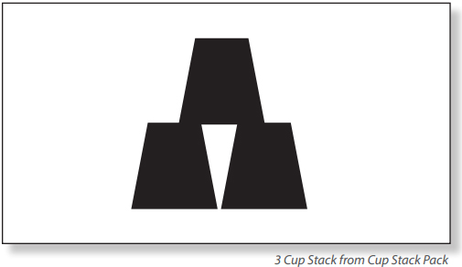
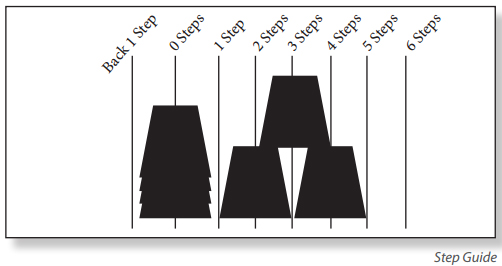
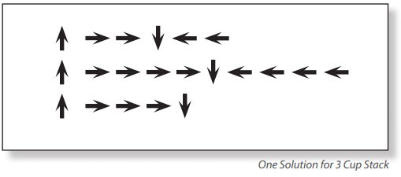
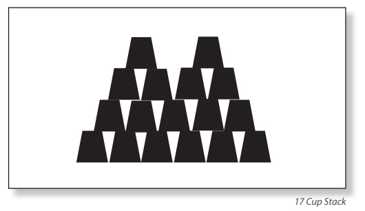
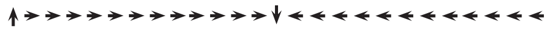
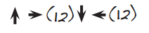
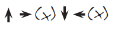
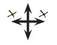

Denne teksten er en oversettelse av en originaltekst fra
[ThinkerSmith](http://thinkersmith.org/), og er lisensiert i henhold
til retningslinjene nederst på siden.

# Introduksjon {.intro}

Mine Robotvenner introduserer elevene for prinsippene bak programmering,
og illustrerer behovet for funksjoner.

Ved å bruke et forhåndsdefinert _robotordforråd_ skal elevene styre
hverandre gjennom forskjellige oppgaver, uten å diskutere dem
først. Dette lærer elevene sammenhengen mellom symboler og handlinger,
i tillegg til å gi verdifull innsikt i feilsøking.

Beregnet gjennomføringstid er 1 time per klasse. Beregnet
forberedelsestid: 10 minutter.

# Læringsmål {.activity}

## Elevene skal {.check}

+ Lære å omgjøre virkelige handlinger til instruksjoner.
+ Få praktisk erfaring i å kode med symboler.
+ Oppnå en forståelse for nødvendigheten av presisjon innen koding.
+ Erfare hvordan feilsøking gjøres for å finne feil i koden.
+ Forstå hvor nyttige funksjoner og parametere er (trinn 7+).

# Materiell og forberedelser {.activity}

## Materiell {.check}

+ Symbolark (1 per gruppe),
  [last ned her](robotvenner_symbolark.pdf).
+ Pakke med koppestablefigurer (1 per gruppe),
  [last ned her](robotvenner_figurer.pdf).
+ Engangskopper eller [papirtrapeser](robotvenner_trapeser.pdf) (6
  eller flere per gruppe).
+ Blanke ark eller notatkort (1 per person).
+ Noe å skrive med (1 per person).

## Forberedelser {.check}

+ Skriv ut ett [symbolark](robotvenner_symbolark.pdf) til hver gruppe.
+ Skriv ut arket med [trapesfigurer](robotvenner_trapeser.pdf), om
  kopper ikke brukes.
+ Plassér koppene eller papirtrapesene på et eget bord litt unna der
  gruppene skal være (dette er _robotbiblioteket_).

## Ordforråd {.check}

+ _Algoritme_ – en serie av instruksjoner som beskriver hvordan en kan
  oppnå et mål.
+ _Koding_ – Omgjøre handlinger til et symbolspråk.
+ _Feilsøking_ – Finne og rette feil og problemer i koden.
+ _Funksjon_ – Kode som kan brukes om og om igjen.
+ _Parameter_ - Ekstra informasjon som kan legges til en funksjon, for
  å tilpasse den.

# Gjennomføring {.activity}

## Introduksjon

Begynn med å spørre klassen om noen har hørt om roboter. Om noen har
sett eller tatt på en robot?  Kan en sånn maskin _høre_ deg snakke?
_Forstår_ den faktisk det som blir sagt?  Svaret på det siste
spørsmålet er: _Ikke på samme måte som et menneske gjør_.

Roboter trenger en serie med _instruksjoner_, spesifikke ting de har
blitt satt til å gjøre. For å kunne gjennomføre en oppgave trenger en
robot en rekke med instruksjoner (ofte kalt en algoritme) den kan
utføre. I dag skal vi lære hva som trengs for å få dette til.

## Start

Vis frem en kopi av [symbolarket](robotvenner_symbolark.pdf) (eller
skriv symbolene på tavlen). Fortell at det kun er lov å bruke disse
seks symbolene i denne oppgaven. I denne utfordringen skal elevene
instruere sin _robot_ (en annen elev) til å bygge en gitt stabel med
kopper ved å kun bruke disse gitte instruksjonene.

## Tilpasninger {.protip}

### Barnehagen og småskolen

+ Gjør oppgaven med alle barna/elevene samlet. La barna/elevene gi
  instruksjoner som læreren skal skrive ned.
+ La en (voksen) assistent være roboten. Assistenten forlater rommet
  mens barna/elevene programmerer, for så å komme tilbake og prøve å
  utføre koden.
+ Om det er nok tid bytter assistenten og læreren plass. Assistenten
  programmerer sammen med barna/elevene, mens læreren utfører koden i
  etterkant.

### Mellomtrinnet

+ Del inn i grupper på 3 til 5 tilpasset hvordan klassen samarbeider.
+ Forvent at alle har lyst å prøve å være robot, slik at dette vil
  sannsynligvis bruke hele timen.

### Ungdomsskolen og videregående

+ Del inn i grupper på maksimalt fire elever, tre i hver gruppe er
  ideelt.
+ Elevene får da nok tid til at alle får prøvd seg som robot, og kan
  også prøve seg på ekstraoppgavene om funksjoner som står beskrevet
  lenger ned.

## Komme i gang

+ Velg en elev til å være _robot_ i hver gruppe.
+ Send roboten til _robotbiblioteket_, mens resten av gruppen er
  programmererne som koder.
+ Velg en figur fra [koppestablefigurene](robotvenner_figurer.pdf) for
  hver gruppe.
+ Gruppene skal lage en algoritme for hvordan roboten skal bygge den
  utvalgte stabelen.
+ De som koder skal oversette algoritmen sin til piler, som beskrevet
  på [symbolarket](robotvenner_symbolark.pdf).
+ Når programmererne er ferdig med koden henter de roboten sin.
+ Roboten leser pilene på arket og prøver å gjennomføre koden med
  bevegelser.
+ Resten av gruppen ser etter feil, samarbeider om å rette feilene i
  koden, og ber deretter roboten om å kjøre programmet på nytt.

  

## Regler

+ Programmererne skal _kun_ benytte de seks pilene på
  [symbolarket](robotvenner_symbolark.pdf).
+ Koppene skal være hos roboten og ikke tilgjengelig for
  programmererne under kodingen.
+ Når roboten kommer tilbake til gruppen skal de ikke snakke
  sammen. Instruksjonene er skrevet på papiret!

_Om elevene spør om regler som ikke er nevnt over kan du enten
definere dem selv basert på egen erfaring, eller be dem å
bestemme reglene i gruppa_.

# Praktisk eksempel {.activity}

Det er svært nyttig å gå over et av eksemplene med samlet klasse
først. Det er en stabel blant
[koppestablefigurene](robotvenner_figurer.pdf) som bare inneholder tre
kopper. Hold figuren opp for klassen og gå gjennom eksempeløvelsen. En
mulig løsning vil se ut som følger.

Plasser en stabel med kopper på et bord slik atr alle kan se den. Spør
klassen om noen kan fortelle hva du skal gjøre først. Gi dem eventuelt
et hint om å se på de seks mulige instruksjonene på
[symbolarket](robotvenner_symbolark.pdf). Det riktige svaret er
**Plukk opp koppen**. Når du plukker en kopp, pass på at den løftes
slik at den er høyere enn alle de andre koppene på bordet.

Plukk opp den øverste koppen i stabelen, og mens du holder den i
luften over stabelen, spør hva som nå skal gjøres med koppen. Koppen
må nå flyttes **Ett skritt frem** (eller **Ett skritt tilbake**) minst
to ganger. Legg merke til at **Ett skritt** tilsvarer en halv
koppelengde, som på figuren under.

Etter at dere har satt den første koppen på plass kan du gå til
tavlen. Utfordre nå klassen til i fellesskap hjelpe deg med å skrive
symbolene som behøves for å plassere alle tre koppene. En mulig
løsning vil være

Etter at hele _programmet_ er skrevet ned kan du få en elev til å
utføre det, eller du kan kjøre det selv. Si navnet på symbolene høyt
etterhvert som du eller eleven flytter på koppene. For eksempel vil
programmet ovenfor uttales:

> Plukk opp koppen. Ett skritt frem. Ett skritt frem. Sett ned
> koppen. Ett skritt tilbake. Ett skritt tilbake.
>
> Plukk opp koppen. Ett skritt frem. Ett skritt frem. Ett skritt
> frem. Ett skritt frem. Sett ned koppen. Ett skritt tilbake. Ett
> skritt tilbake. Ett skritt tilbake. Ett skritt tilbake.
>
> Plukk opp koppen. Ett skritt frem. Ett skritt frem. Ett skritt
> frem. Sett ned koppen.

# Hovedøvelse {.activity}

#### Del i grupper

Del gruppen som tidligere nevnt under [Tilpasninger](#tilpasninger).
Målet er å ha nok programmerere i gruppen til at gruppen hele tiden
kommer videre.

#### Robot

Velg en _robot_ i hver gruppe, som skal vente i _robotbiblioteket_.
Dette bør være et sted langt nok unna gruppene slik at ingen roboter
får med seg hvilken stabel programmererne jobber med. Robotene kan
bruke ventetiden på å øve på å stable kopper eller til å se på reglene
og spørre om noe er uklart.

#### Program

Hver gruppe bør bare jobbe med en koppestablingsfigur om gangen. De
kan begynne med å finne algoritmen for denne stabelen. Hvor mange
kopper trenger de? Hvor mange bevegelser må til for å plassere den
første koppen? Den neste koppen? Er noen kopper opp ned? Hvordan kan
de instruere roboten til å snu koppen?

Når de har funnet ut av disse spørsmålene, skal programmererne skrive
ned symbolene for å lage koden på arket. Programmererne bør
dobbeltsjekke koden sin før de henter roboten fra robotbiblioteket.

#### Kjør koden

Når som roboten kommer tilbake skal alle være stille. Gruppene skal
unngå å vise bevegelser eller bruke ord for å hjelpe roboten. Roboten
skal bare følge instruksjonene pilene gir. Om gruppen oppdager en
feil, kan de stoppe programmet. De sender da roboten tilbake til
robotbiblioteket, retter feilen før de henter roboten som prøver å
kjøre programmet igjen fra begynnelsen.

#### Gjenta

Hver gang en gruppe løser en oppgave velge de en ny robot som sendes
til robotbiblioteket. Gruppen starter også med en ny
koppestablingsfigur, helst vanskeligere enn den forrige.

Dette fortsetter til alle i gruppen har vært robot en gang, man går
tom for tid, eller koppestablingsfigurene er vanskelige nok til å
snakke om funksjoner (se [Ekstraoppgaver](#ekstraoppgaver) nedenfor).

### Tips {.protip}

Om gruppene er i ferd med å gå tom for koppestablingsfigurer kan du
utfordre dem til å lage sine egne!

# Ekstraoppgaver {.activity}

Om det er nok tid, så er dette en flott mulighet til å introdusere
nyttigheten av _funksjoner_.

#### Introduksjon

Samle klassen og fortell dem at du vil vise dem en spesiell
koppestablingsfigur som de skal kode på rekordtid ... Vis dem så dette
bildet:

Du vil mest sannsynlig høre surmuling, fnising og til og med at dette
er umulig. Spør klassen hva problemet er? Hvorfor er denne stabelen så
problematisk?

Denne stabelen virker vanskelig, fordi hver ekstra kopp i bredden
legger til to ekstra piler med **Ett skritt frem** og to ekstra piler
med **Ett skritt tilbake**. For å skrive kode for denne figuren vil
etterhvert instruksjonene se slik ut:

Ofte vil elevene begynne å forkorte instruksjonene, for eksempel ved å
skrive tall etter pilene:

Under hovedøvelsen anbefales ikke dette. Minn elevene på at de kun
skal bruke de seks instruksjonene på symbolarket. Til disse mer
kompliserte oppgavene trenger vi kraftigere instruksjoner. Gi elevene
ros for at de tenkte selv og oppdaget behovet for funksjoner.

#### Forklar

Vis klassen at en pil etterfulgt av et tall er en smart måte å
indikere at en instruksjon skal gjentas flere ganger. Ved å tillate
dette, lager vi egentlig bare et nytt symbol som kan brukes for å
unngå unødvendig repetisjon. Dette er nettopp ideen bak funksjoner.

Utfordre klassen til å finne den lengste rekken med repeterende kode
for hver kopp-plassering. Som instruktør kan du godta alle slags
grupperinger som gir mening, men de vil nok ligne noe av det vi så
tidligere:

Dette er en god begynnelse, men det kan forenkles ytterligere. Om vi
plasserer pillene med klokken (starter på toppen), og setter dem
sammen i èn får vi noe som ser slik ut:

Her er **x** antall skritt vi først må flytte frem og deretter
tilbake. Denne **x**'en blir _parameteren_ til vår funksjon.

#### Parametere

Ovenfor har vi et pilsymbol som minner om de tidligere symbolene, men
vi har også introdusert en måte å inkludere mer informasjon om hvor
mange ganger vi vil at pilene framover og bakover skal brukes. I
dataverdenen blir denne ekstra informasjonen kalt _parameter_. Disse
parametrene kan brukes for å tilpasse allerede nyttige funksjoner til flere forskjellige situasjoner.

#### Omstabling

Nå som klassen har dette nye symbolet kan de prøve å løse en av de mer
krevende koppestablefigurene. Gruppene kan samarbeide om de trenger
ekstra kopper.
